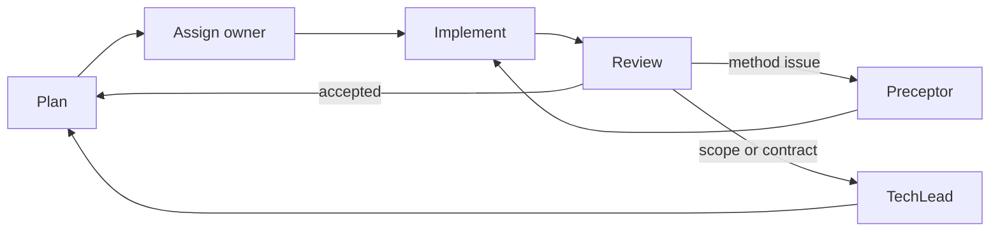

# Shared agent rules

1. Read the canonical model and existing tests before changing behavior.
2. Modify only files listed under the agent's ownership section.
3. Preserve immutable BigQuery source identifiers; proposed Fabric names are separate outputs.
4. Treat dynamic SQL, JavaScript UDFs, BQML, policy tags, and cross-project dependencies as
   explicit review items when equivalence cannot be proven.
5. Validate the narrow changed behavior first, then run the full suite.
6. Cloud deployment must remain opt-in and dry-run by default.

## Working loop

Every implementation agent runs the same loop:

1. **Plan** — record the expected behaviour before writing code.
2. **Assign** — one owner per path. Do not edit another agent's owned files.
3. **Implement** — the smallest change that makes the expected behaviour true.
4. **Review** — run the gates, then hand off to `Documentation`.

## Escalation

| Escalate to | When |
|---|---|
| `Preceptor` | Uncertain how to verify a change, a test fails after a fix and you are unsure whether it protected the contract or the bug, or a fixture's shape is unconfirmed. |
| `TechLead` | Scope is growing, two agents need the same file, a published contract would change, or a gate stands in the way. |

Escalate early. A blocked gate is information, never an obstacle to remove.
