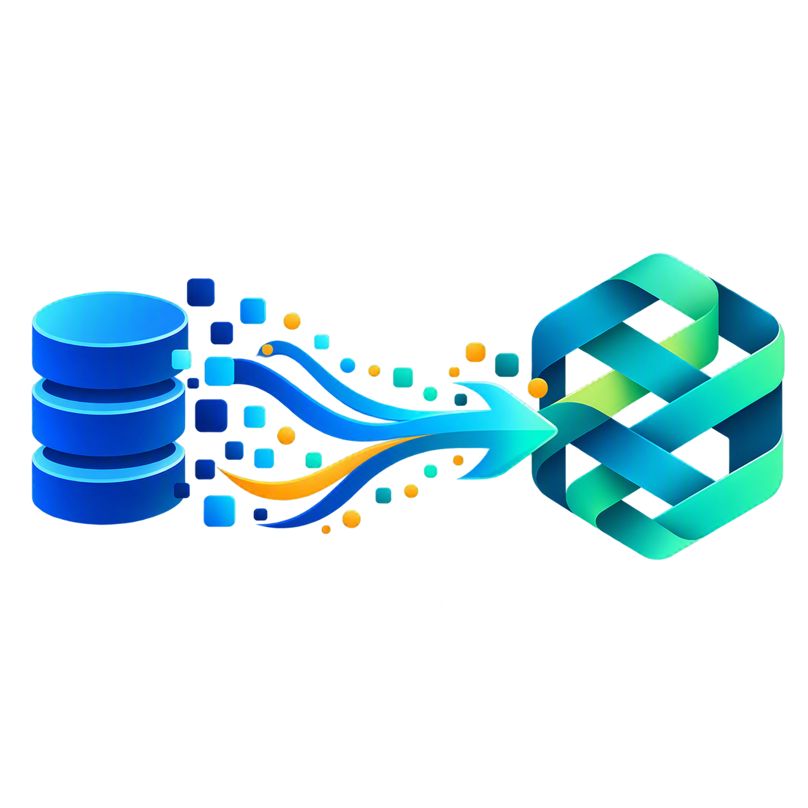
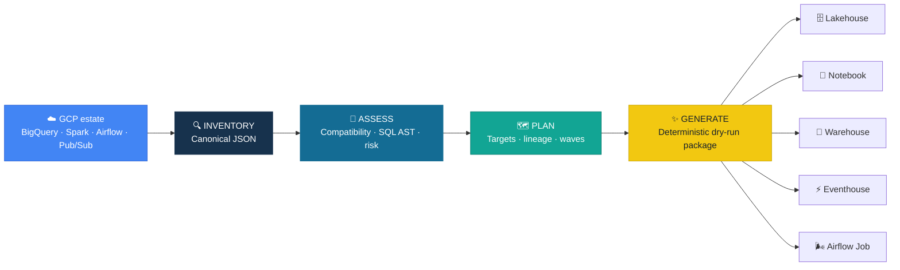

<p align="center">
	
</p>

<h1 align="center">✨ BigQuery → Microsoft Fabric</h1>

<p align="center">
	<strong>Evidence-based assessment and migration planning for the GCP data platform.</strong><br/>
	Inventory workloads, select the right Fabric targets, order migration waves, and generate
	reviewable dry-run artifacts before any cloud change occurs.
</p>

<p align="center">
	
	
	
	
	
</p>

| | Verified baseline |
|---|---|
| 🔍 **Discovery** | Read-only BigQuery metadata · credentials redacted by construction |
| 🧭 **Assessment** | 25 GCP/BigQuery source types · normalized readiness score · explainable findings |
| 🏗️ **Fabric routing** | 15 target roles · Lakehouse/Notebook preference · workload overrides |
| 🧪 **Quality** | 30 tests passed · 93.2% coverage · Ruff and Pyright clean |
| 🤖 **Agent model** | 9 specialist agents · ownership and skill contracts validated |
| 🔒 **Safety** | Deterministic output · no credentials · no cloud mutation |

> [!IMPORTANT]
> BQToFabric `0.1.0` is an **assessment and dry-run generation toolkit**. Discovery is read-only and
> has not yet been verified against a live GCP estate, and nothing is deployed to Fabric. Generated
> definitions are review artifacts, not production deployment payloads.

## ⚡ Quick Start

```powershell
python -m pip install -e ".[dev]"

# Optional: discover a live project read-only (requires the gcp extra and ADC)
python -m pip install -e ".[gcp]"
bqtofabric discover my-gcp-project --output artifacts/inventory.json

# Validate and inspect an inventory
bqtofabric validate tests/fixtures/gcp_ecosystem_project.json
bqtofabric inventory tests/fixtures/gcp_ecosystem_project.json

# Assess, plan, and generate the dry-run migration package
bqtofabric assess tests/fixtures/gcp_ecosystem_project.json
bqtofabric plan tests/fixtures/gcp_ecosystem_project.json --output artifacts/gcp-plan
bqtofabric generate tests/fixtures/gcp_ecosystem_project.json --output artifacts/gcp-project
```

The generated package contains:

- `assessment.json` — score, evidence, SQL analysis, findings, and portfolio summaries.
- `component-mapping.csv` — primary/supporting targets, compatibility, rationale, and actions.
- `migration-plan.md` and `migration-plan.json` — dependency-ordered migration waves.
- `lineage.mmd` — Mermaid dependency graph.
- `fabric/` — dry-run Warehouse SQL, Fabric notebook, pipeline, and orchestration manifests.

<details>
<summary><b>📦 Installation and development setup</b></summary>

```powershell
git clone <repository-url>
cd BQToFabric
python -m venv .venv
.\.venv\Scripts\Activate.ps1
python -m pip install -e ".[dev]"
python -m pytest
```

**Requirements:** Python 3.12+ and `sqlglot` for structured GoogleSQL analysis.

</details>

## 🎯 What It Assesses

<table>
<tr>
<td width="50%">

### 🗄️ Data and SQL
BigQuery tables, views, materialized views, external tables, routines, procedures,
scheduled queries, GoogleSQL scripts, nested `ARRAY`/`STRUCT`/`JSON`, partitioning,
clustering, GCS sources, Cloud SQL, and Spanner.

</td>
<td width="50%">

### ⚙️ Engineering and orchestration
Spark, Dataproc, Apache Beam/Dataflow, Dataform, Composer/Airflow, GCP Workflows,
connections, dependencies, retries, schedules, state, and migration waves.

</td>
</tr>
<tr>
<td>

### ⚡ Streaming and events
Pub/Sub and streaming jobs mapped to Eventstream/Eventhouse when low-latency event
analytics dominates, with optional Lakehouse retention for medallion processing.

</td>
<td>

### 📊 BI, ML, and governance
Looker, BQML, Vertex AI, Dataplex, policy tags, row access policies, Purview,
semantic models, Power BI reports, Data Science, and explicit manual-review boundaries.

</td>
</tr>
</table>

## 🧭 Target Strategy

The requested default is **Lakehouse + Notebook**, but preferences never override stronger
technical evidence.

| Source evidence | Recommended Fabric design |
|---|---|
| Spark, nested data, medallion, ML features | **Lakehouse + Notebook** |
| Structured BI, T-SQL, DML, multi-table transactions | **Warehouse** |
| Pub/Sub, Beam streaming, high-granularity events | **Eventstream + Eventhouse** |
| Existing Composer DAG with reusable operators | **Fabric Airflow Job** + Lakehouse/Notebook |
| Cloud SQL or transactional application data | **SQL Database** + analytical replication |
| BQML or Vertex AI lifecycle | **Fabric Data Science** + Lakehouse/Notebook |
| Looker semantic layer | **Semantic model + Power BI report** |
| Dataplex and classifications | **Purview + Fabric domains** |

Set advisory preferences in the canonical inventory:

```json
{
	"metadata": {
		"preferences": {
			"data_target": "lakehouse",
			"compute_target": "notebook",
			"preserve_airflow": true
		}
	}
}
```

## 🏗️ How It Works



Every mapping is classified as `direct`, `transform`, `redesign`, or `unsupported` and
includes a rationale plus concrete follow-up actions. GoogleSQL is parsed as an AST with
`sqlglot`; ETL logic is never translated to DAX.

## 🧰 CLI

| Command | Purpose |
|---|---|
| `bqtofabric discover` | Inventory a live BigQuery project read-only, with credentials redacted |
| `bqtofabric inventory` | Summarize datasets and components by source type |
| `bqtofabric validate` | Validate the canonical inventory contract |
| `bqtofabric assess` | Produce readiness, target, type, SQL, and risk evidence |
| `bqtofabric map` | Print component-level Fabric decisions |
| `bqtofabric plan` | Generate dependency-ordered migration waves |
| `bqtofabric generate` | Produce the complete dry-run assessment package |

## ✅ Verified Baseline

Validated locally on Python 3.13 against the committed synthetic GCP portfolio:

```powershell
python scripts/validate_agents.py
python -m ruff check src tests scripts
python -m pyright
python -m pytest --cov=bqtofabric --cov-report=term-missing --cov-fail-under=80
```

- `30 passed`
- `93.25%` package coverage
- `0` Ruff findings
- `0` Pyright errors or warnings
- `9` agents and `1` skill contract validated
- Reference portfolio: `19` components, Lakehouse primary, hybrid architecture, Airflow retained

## 🗺️ Roadmap

The next development tracks are live GCP discovery, deeper SQL/Spark conversion, production-grade
Fabric artifacts, parity validation, and opt-in deployment. See the full
[development roadmap](docs/ROADMAP.md) for priorities, deliverables, and release gates.

## 📚 Documentation

| Guide | Purpose |
|---|---|
| [Architecture](docs/ARCHITECTURE.md) | Pipeline and ownership boundaries |
| [GCP component assessment](docs/GCP_COMPONENT_ASSESSMENT.md) | Supported source families and evidence |
| [Mapping reference](docs/MAPPING_REFERENCE.md) | BigQuery/GCP to Fabric mapping rules |
| [Target decision guide](docs/TARGET_DECISION_GUIDE.md) | Lakehouse, Warehouse, Eventhouse, and hybrid choices |
| [Migration runbook](docs/MIGRATION_RUNBOOK.md) | Operational assessment workflow |
| [Known limitations](docs/KNOWN_LIMITATIONS.md) | Explicit V1 boundaries |
| [Security](docs/SECURITY.md) | Credentials, identities, and governance constraints |
| [Agents](docs/AGENTS.md) | Specialist-agent ownership model |

## 🔒 Safety Principles

- No credentials, service-account keys, tokens, tenant IDs, or secrets in inventories or output.
- No cloud mutation in the default path.
- Native Fabric BigQuery connectors are preferred over proprietary data movers.
- Unsupported security semantics fail closed and require manual review.
- Generated output is deterministic and suitable for source control and review.

---

<p align="center">
	<strong>Assess first. Preserve intent. Move each workload to the Fabric service that fits it.</strong>
</p>

