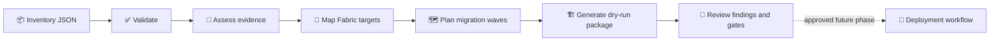
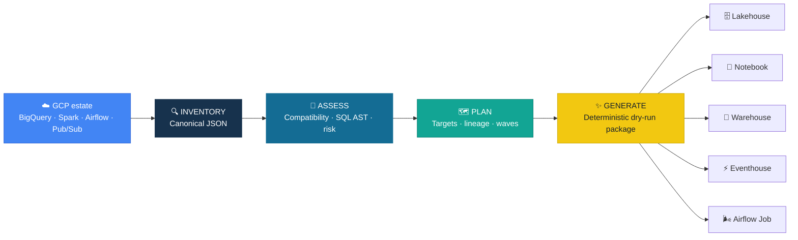

<p align="center">
	
</p>

<h1 align="center">✨ BigQuery → Microsoft Fabric</h1>

<p align="center">
	<strong>Evidence-based assessment and migration planning for the GCP data platform.</strong><br/>
	Inventory workloads, select the right Fabric targets, order migration waves, and generate
	reviewable dry-run artifacts before any cloud change occurs.
</p>

<p align="center">
	
	
	
	
	
	<a href="LICENSE"></a>
</p>

| | Verified baseline |
|---|---|
| 🔍 **Discovery** | Read-only BigQuery metadata · credentials redacted by construction |
| 🧭 **Assessment** | 25 GCP/BigQuery source types · normalized readiness score · explainable findings |
| 🏗️ **Fabric routing** | 15 target roles · Lakehouse/Notebook preference · workload overrides |
| 🧪 **Quality** | 304 tests passed · Ruff and Pyright clean (`python -m pyright`; `python -m ruff check src tests`) |
| 🤖 **Agent model** | 10 specialist agents · exclusive ownership and documentation handoff validated |
| 🔒 **Safety** | Deterministic output · no credentials · no cloud mutation |

## 🧭 How It Works



**Core contract:** inventory → canonical model → assessment/mapping → strategy → dependency plan →
deterministic dry-run artifacts. The deployment arrow is intentionally outside the default path.

## 🧩 The Canonical Inventory

The inventory is the stable boundary between discovery and planning. It holds source IDs, object
kinds, columns, dependencies, workload evidence, and provenance without cloud credentials.

```mermaid
flowchart TD
	ROOT[Inventory JSON] --> META[project_id + schema_version]
	ROOT --> DS[datasets[]]
	ROOT --> CP[components[]]
	DS --> OBJ[BigQueryObject]
	CP --> OBJ
	OBJ --> COL[columns[]]
	OBJ --> DEP[dependencies[]]
	OBJ --> EVD[properties + discovered_from]
```

See the complete field reference and example in [docs/INVENTORY_SCHEMA.md](docs/INVENTORY_SCHEMA.md).

`JsonInventoryProvider` validates this contract before model coercion: project IDs, dataset/object
IDs and names, known object kinds, duplicate source IDs, column structures, dependency arrays,
and non-negative `size_bytes`. An explicit `null` `size_bytes` remains valid optional evidence.
These are deterministic offline checks; they do not validate cloud schemas, runtime behavior, data
parity, or deployment readiness.

> [!IMPORTANT]
> BQToFabric `0.1.0` is an **assessment and dry-run generation toolkit**. Discovery is read-only and
> has not yet been verified against a live GCP estate, and nothing is deployed to Fabric. Generated
> definitions are review artifacts, not production deployment payloads.

## ⚡ Quick Start

```powershell
python -m pip install -e ".[dev]"

# Optional: discover a live project read-only (requires the gcp extra and ADC)
python -m pip install -e ".[gcp]"
bqtofabric discover my-gcp-project --output artifacts/inventory.json
# Add one or more explicit Dataflow regions; no regions means BigQuery-only discovery.
bqtofabric discover my-gcp-project --dataflow-region europe-west1 --output artifacts/inventory.json

# Validate and inspect an inventory
bqtofabric validate tests/fixtures/gcp_ecosystem_project.json
bqtofabric inventory tests/fixtures/gcp_ecosystem_project.json

# Assess, plan, and generate the dry-run migration package
bqtofabric assess tests/fixtures/gcp_ecosystem_project.json
bqtofabric plan tests/fixtures/gcp_ecosystem_project.json --output artifacts/gcp-plan
bqtofabric generate tests/fixtures/gcp_ecosystem_project.json --output artifacts/gcp-project
bqtofabric manifest-verify artifacts/gcp-project/fabric/deployment-manifest.json
bqtofabric deployment-check artifacts/gcp-project/fabric
```

The generated package contains:

- `assessment.json` — score, evidence, SQL analysis, findings, and portfolio summaries.
- `component-mapping.csv` — primary/supporting targets, compatibility, rationale, and actions.
- `migration-plan.md` and `migration-plan.json` — dependency-ordered migration waves, including
	`manual_review` decisions and deterministic `manual_review_reasons` codes. The Markdown report
	also includes a `Findings` section listing assessment findings by severity, code, category,
	source, and message.
- `lineage.mmd` — Mermaid dependency graph.
- `fabric/target-manifest.json` — target entries with `processingStage`, `wave`, source
	`dependencies`, `manualReview`, and deterministic `manualReviewReasons`; its top-level
	`stageReadiness` summarizes every stage represented by entries. Each summary includes `total`,
	counts for `direct`, `transform`, `redesign`, and `unsupported`, `manualReview`, and a
	deterministic `readiness` score. Stages with no entries are omitted.
- `fabric/deployment-manifest.json` — immutable dry-run payload with SHA-256 integrity hash.
- `fabric/artifact-validation.json` — offline structural validation results.
- `fabric/deployment-manifest.json` is checked by `deployment-check`; readiness never performs apply.

## User Manual

For the complete installation guide, command reference, offline and read-only discovery workflows,
artifact interpretation, security rules, and troubleshooting, see [docs/USER_MANUAL.md](docs/USER_MANUAL.md).

For a one-command PowerShell fixture walkthrough, run `./scripts/smoke_test.ps1` after installing
the development package.

### Documentation map

| 📘 Guide | Use it when you need to... |
|---|---|
| [User manual](docs/USER_MANUAL.md) | Install, run workflows, interpret outputs, and troubleshoot |
| [Inventory schema](docs/INVENTORY_SCHEMA.md) | Author or validate canonical inventory JSON |
| [Architecture](docs/ARCHITECTURE.md) | Understand ownership boundaries and processing stages |
| [Mapping reference](docs/MAPPING_REFERENCE.md) | Review source-to-Fabric target decisions |
| [Migration runbook](docs/MIGRATION_RUNBOOK.md) | Execute a repeatable assessment and review process |
| [Security](docs/SECURITY.md) | Apply credential and access-evidence rules |
| [Roadmap](docs/ROADMAP.md) | Track implemented, validated, and open work |

### 📊 Assessment proposal

Open the self-contained [assessment and migration proposal](docs/assessment-proposal.html) for a
visual scorecard, blocker summary, target portfolio, six-wave migration proposal, and approval
checklist based on the sanitized GCP ecosystem fixture.

### Generated artifact validation

`validate_artifact` scans persisted `.json`, `.ipynb`, `.sql`, and `.kql` text with
`CredentialScanner` before applying the format-specific checks. Credential failures report only
the finding type and never the matched secret value. `validate_directory` applies this scan
recursively across the generated package and its subdirectories, alongside notebook, JSON, SQL,
KQL, and pipeline dependency checks. It also checks each target-manifest entry against the
generated artifact manifest, verifies that referenced generated paths exist, and fails when a
non-review target references an invalid artifact. Invalid artifacts intentionally marked for
manual review remain allowed as review-only scaffolds.

This behavior was validated with `python -m pytest tests/test_artifact_validation.py
tests/test_security.py -v` (`10 passed`). These are offline pattern and structural checks only;
pattern scanning is not a substitute for official Fabric schema validation or deployment
validation. The complete suite was also validated with `python -m pytest -q` (`306 passed`).
These checks remain offline-only and do not perform cloud operations.

### Contract-hardening validation

Artifact validation rejects a non-object JSON root with a deterministic validation error instead
of raising. Parity comparison rejects negative or boolean row counts, duplicate schema field names,
and malformed nested fields as `not_run`. These checks are offline input validation only and do not
establish Fabric schema validity, runtime execution, or data parity.

Validated with:

```powershell
python -m pytest tests/test_artifact_validation.py -v  # 7 passed
python -m pytest tests/test_parity.py -v                # 18 passed
```

### CLI and deployment-readiness failure paths

The CLI reports deterministic failures for invalid local inputs: a missing inventory returns exit
code `2`, malformed inventory returns exit code `5`, and tampered deployment-manifest verification
returns exit code `5`. `deployment-check` blocks when artifact validation is invalid, and readiness
blocks when dependencies remain unresolved or a target component is unsupported. These checks stop
the local dry-run workflow before any deployment action is possible.

This contract was validated with:

```powershell
python -m pytest tests/test_cli.py tests/test_deployment_readiness.py -v
```

The focused suite passed with `14 passed`. The checks are offline-only: they do not validate
official Fabric schemas or APIs, execute workloads, establish runtime or data parity, or authorize
deployment. Cloud operations remain outside the default path.

## How to Test the Assessment

### Local fixture smoke test

This workflow is deterministic, offline, and uses the committed sanitized fixture:
`tests/fixtures/gcp_ecosystem_project.json`.

```powershell
python -m pip install -e ".[dev]"
python -m pytest
python -m pyright
python -m ruff check src tests

$fixture = "tests/fixtures/gcp_ecosystem_project.json"
$output = "artifacts/assessment-smoke"

bqtofabric validate $fixture
bqtofabric inventory $fixture
bqtofabric assess $fixture
bqtofabric plan $fixture --output "$output/plan"
bqtofabric generate $fixture --output "$output/project"
bqtofabric manifest-verify "$output/project/fabric/deployment-manifest.json"
bqtofabric deployment-check "$output/project/fabric"
```

Inspect the generated `migration-plan.md` `Findings` section, then review
`assessment.json` fields `findings`, `evidence_summary`, `discovery_coverage`, and
`parity_summary`. In `fabric/target-manifest.json`, check `stageReadiness`,
`manualReview`, `manualReviewReasons`, and `processingStage`. Also inspect
`fabric/artifact-validation.json` and `fabric/deployment-manifest.json`.

Treat every `FAIL` as a blocking evidence or compatibility issue until it is resolved or
explicitly accepted by the migration review. Triage `WARN` findings for required design or
manual checks. Exit code `3` indicates that read-only discovery could not establish the required
ADC, API, or metadata visibility; it is not a deployment result.

### Live BigQuery metadata assessment

Live discovery requires the optional `[gcp]` dependencies, user Application Default Credentials
(ADC), and the BigQuery, BigQuery Data Transfer, and BigQuery Connection APIs enabled:

```powershell
python -m pip install -e ".[dev,gcp]"
gcloud auth application-default login

$project = "<project-id>"
$output = "artifacts/$project"

bqtofabric discover $project --output "$output/inventory.json"
bqtofabric validate "$output/inventory.json"
bqtofabric assess "$output/inventory.json"
bqtofabric plan "$output/inventory.json" --output "$output/plan"
bqtofabric generate "$output/inventory.json" --output "$output/project"
bqtofabric manifest-verify "$output/project/fabric/deployment-manifest.json"
bqtofabric deployment-check "$output/project/fabric"
```

The live step reads BigQuery metadata and, only for explicitly supplied `--dataflow-region` values,
regional Dataflow job metadata. It keeps all subsequent assessment, planning, generation, and
readiness checks local and non-destructive. Dataflow job evidence remains conservative: `portable`
and `connector_compatible` are absent unless supplied by the API payload, so assessment reports
missing evidence rather than inferring compatibility. Dataproc payload normalization maps PySpark
to `language: python`, Spark SQL/Hive to `language: sql`, and Pig to `language: pig`; unsupported
or ambiguous types are `unknown`, while the existing `runtime` classification is retained.
`runtime_version` comes from the referenced cluster's `config.softwareConfig.imageVersion` when
present, otherwise `unknown`. Assessment treats `unknown` and `not specified` as missing evidence.
Supply the runtime version or re-discover from a payload whose referenced cluster includes
`imageVersion` before readiness can be complete. Composer, Dataproc, Dataform, Workflows,
Pub/Sub, GCS, Looker, Vertex AI, Dataplex, Cloud SQL, and Spanner remain offline payload
normalization and assessment inputs only. Never place credentials, tokens, service-account keys,
or tenant/workspace secrets in inventories or generated artifacts.


### Manual-review decisions

`manual_review` remains the planner's decision flag. When it is set, the corresponding `PlanItem`
also contains deterministic `manual_review_reasons` so the review is actionable. Generated
`migration-plan.md` renders the flag and codes; `fabric/target-manifest.json` exposes the same
values as `manualReview` and `manualReviewReasons`. The supported reason codes are
`external_dependency`, `incompatible_mapping`, `streaming_downstream_review`,
`incomplete_external_adapter`, `depends_on_incomplete_external_adapter`, `sql_incompatibility`,
`incomplete_dataform_compilation`, `depends_on_incomplete_dataform_compilation`, and
`cycle_or_unresolved_dependency`. This is offline planning metadata only and makes no cloud calls
or deployment changes.

### Migration-plan findings

Generated `migration-plan.md` includes a `Findings` section that carries assessment findings into
the review report. Each finding lists `severity`, `code`, `category`, `source`, and `message` so
`WARN` and `FAIL` outcomes can be triaged from the plan without opening `assessment.json` first.
These findings are dry-run evidence only; their presence does not prove remediation, deployment
readiness, or Fabric runtime parity.

### Schedule-trigger start time

Generated schedule triggers use the Fabric expression `@utcNow()` for `startTime`, so a generated
pipeline does not retain the stale fixed `2024` start date. This applies to the supported preset
schedule mappings and is deterministic dry-run generation behavior.

This contract was validated with `python -m pytest tests/test_artifact_generation.py -v` (`44
passed`). Generated pipeline definitions still require validation against the official Fabric/ADF
schema and deployment validation before they can be treated as deployable.

### Pipeline activity resilience defaults

Generated operational pipeline activities receive deterministic defaults of `retry: 3`,
`retryIntervalInSeconds: 30`, `secureInput: true`, and `secureOutput: true`. The failure handler
retains its specialized secure policy. This behavior was validated with
`python -m pytest tests/test_artifact_generation.py -v` (`44 passed`). Retry behavior still requires
validation against the official Fabric/ADF schema and runtime validation; these defaults do not
establish retry execution or deployment readiness.

### Assessment summary

The generated `migration-plan.md` also includes an `Assessment summary` section. Its Gate/Value
table reports total findings, `FAIL` findings, `WARN` findings, and the number of components
requiring manual review, plus `Parity checks` and `Parity not run` totals. The section also
provides deterministic readiness percentages and manual-review counts by processing stage,
followed by counts for each manual-review reason. `Parity not run` means runtime evidence is
absent; it does not mean that parity succeeded. The detailed `Parity evidence` table is unchanged.
These are review summaries for prioritization, not proof of deployment readiness, runtime parity,
security remediation, or finding remediation.

### Performance-layout assessment

- **Expected:** Large BigQuery objects with incomplete recorded layout metadata should be surfaced
	for design review without implying measured performance behavior or automatic tuning.
- **Implemented:** For `TABLE`, `EXTERNAL_TABLE`, and `MATERIALIZED_VIEW` objects at or above
	`10 GiB`, assessment emits deterministic `WARN` findings when inventory metadata lacks a
	partition field or clustering fields: `PERFORMANCE_PARTITION_REVIEW` and
	`PERFORMANCE_CLUSTERING_REVIEW`. The findings are based only on recorded inventory evidence.
- **Validated:** `python -m pytest tests/test_assessment.py -v` passed with `16 passed`.
- **Open:** Measured workload telemetry and runtime benchmarking remain open. These findings are
	design-review recommendations, not measured performance claims or automatic partitioning,
	clustering, or indexing decisions.

### Stage-readiness summary

`fabric/target-manifest.json` groups entries by `processingStage` in its top-level
`stageReadiness` object. For each represented stage, `readiness` is the rounded weighted average
of component compatibility: `direct=100`, `transform=80`, `redesign=50`, and `unsupported=0`.
It prioritizes migration review; it is not proof of execution, parity, security remediation, or
deployment readiness.

### Eventstream review scaffold

Generated Eventstream output is intentionally non-deployable because it is not an official Fabric
Eventstream definition. It sets `deployable: false` and artifact `valid: false`; its source node
uses `connectionReference: review_required` rather than an invented `connectionId`, and it carries
explicit authoring TODOs. The artifact manifest propagates `valid: false`.

This contract was validated with `python -m pytest tests/test_artifact_generation.py -v` (`40
passed`). Before deployment, author the Eventstream against the official Fabric API/schema and
provide approved connections.

### Semantic-model source-schema guard

For a table, view, or materialized view with no discovered columns, semantic-model generation
returns an invalid review-only scaffold instead of referencing a nonexistent first column. The
scaffold has `valid: false`, `deployable: false`, and
`validationStatus: pending_source_schema`; it contains no tables, measures, relationships, or
connection placeholders. It emits a `REDESIGN` warning requiring source-schema discovery and
regeneration. Schema-backed semantic-model generation is unchanged.

This contract was validated with `python -m pytest tests/test_artifact_generation.py -v` (`42
passed`). It remains a dry-run structural guard: validate the regenerated model against the
official Fabric semantic-model schema/API before deployment.

### Semantic-model count-measure fidelity

Generated numeric `Count of <column>` measures use DAX `COUNT`, so they count populated values as
their names imply. This contract was validated with `python -m pytest tests/test_artifact_generation.py
-v` (`44 passed`). Generated semantic models remain dry-run review artifacts and still require
validation against the official Fabric semantic-model schema/API before deployment.

### Deterministic artifact packages

Artifact generation writes every artifact category in sorted source-ID order. JSON artifacts,
manifests, and notebooks use sorted object keys, and generated warnings are aggregated in
source-ID order. Equivalent inventories therefore produce the same artifact paths and bytes even
when their input component order differs.

This behavior was validated with `python -m pytest tests/test_artifact_generation.py -v` (`42
passed`) by generating equivalent inventories with reversed component order and comparing every
artifact path and byte sequence across output directories. Each artifact filename now combines a
filesystem-safe source ID with the first 12 hexadecimal characters of that source ID's SHA-256
digest. Distinct source IDs therefore have distinct paths even when they normalize to the same
safe text, and manifests record those generated paths. This collision protection was validated
with `python -m pytest tests/test_artifact_generation.py -v` (`44 passed`). The generated package
remains a dry-run review artifact, not proof of deployment readiness or Fabric-schema validity.
## Assess A Live GCP Project

Live discovery is read-only BigQuery metadata discovery. It creates a local canonical inventory;
all assessment, mapping, planning, generation, and deployment-readiness steps remain offline and
non-destructive.

1. Install the optional GCP dependencies and enable the **BigQuery API**, **BigQuery Data Transfer
	API**, and **BigQuery Connection API** for the project.
2. Sign in using user Application Default Credentials. Do not use or store service-account JSON.

	```powershell
	python -m pip install -e ".[gcp]"
	gcloud auth application-default login
	```

3. Have a security administrator grant the user least-privilege read access for the required APIs
	and resources, including job-history visibility where required.
4. Run the local workflow:

	```powershell
	bqtofabric discover <project-id> --output artifacts/<project-id>/inventory.json
		# Optional, repeatable regional Dataflow discovery; no region means BigQuery-only
		bqtofabric discover <project-id> --dataflow-region europe-west1 --output artifacts/<project-id>/inventory.json
	bqtofabric validate artifacts/<project-id>/inventory.json
	bqtofabric inventory artifacts/<project-id>/inventory.json
	bqtofabric assess artifacts/<project-id>/inventory.json
	bqtofabric map artifacts/<project-id>/inventory.json
	bqtofabric plan artifacts/<project-id>/inventory.json --output artifacts/<project-id>/plan
	bqtofabric generate artifacts/<project-id>/inventory.json --output artifacts/<project-id>/project
	bqtofabric deployment-check artifacts/<project-id>/project/fabric
	```

	Discovery uses Application Default Credentials (ADC) with
	`https://www.googleapis.com/auth/bigquery.readonly`. It reads datasets; tables, views, materialized
	views, and external tables; routines and procedures; BQML models; jobs; scheduled-query transfer
	configurations; connections; and dataset `access` entries. Dataset access entries are redacted and
	represented as canonical `security_policy` records with `evidence_scope:
	dataset_access_entry`. Assessment emits the `FAIL` finding
	`SECURITY_EFFECTIVE_ACCESS_REVIEW`: these entries do not prove effective project, organization,
	group, or inherited IAM access and require manual security review. Discovery makes no IAM API
	calls and does not extract project/org IAM, connection IAM, Data Policies, policy tags, or
	distinct row access policies. See Google's [ADC guidance](https://docs.cloud.google.com/docs/authentication/provide-credentials-adc)
	and [BigQuery access-control reference](https://docs.cloud.google.com/bigquery/docs/access-control).

	Discovery exit code `3` means ADC, BigQuery API enablement, or required IAM visibility is missing.
	Re-authenticate with `gcloud auth application-default login`, confirm the three required APIs are
	enabled, and have a security administrator review the least-privilege guidance in the
	[migration runbook](docs/MIGRATION_RUNBOOK.md). Provider response bodies are never printed.

External GCP services -- Composer, Dataproc, Dataform, Pub/Sub, GCS, Looker, Vertex AI, Dataplex,
Cloud SQL, and Spanner -- support offline normalization and assessment only. Dataflow is the first
external live adapter, but discovery is read-only, regional, and opt-in through
`--dataflow-region`; it does not perform an all-region scan.

Every canonical component records `discovered_from`: imported inventories default to `inventory`,
live BigQuery discovery records `bigquery_api`, Dataflow discovery records `dataflow_api`, and
normalized external GCP payloads record `external_payload`. Assessment includes the per-object value
in `evidence_summary` and deterministic counts by source in `discovery_coverage`. This distinguishes
API results from supplied associated-service inventory; it does not establish inventory freshness.

For each successfully fetched Dataform compilation result, discovery aggregates canonical
`models`, `assertions`, and `incremental` evidence onto that repository and each of its workflow
records. `models` is the sorted set of compiled table/view target names; `assertions` and
`incremental` are booleans derived from compiled targets and edges. An explicit empty `models: []`
and explicit `assertions: false` or `incremental: false` are complete evidence that the applicable
targets or edges were absent, not incomplete discovery.

Only a failed Dataform compilation-result detail request emits the deterministic
`dataform_workflow` fallback component with `discovered_from: dataform_api`,
`discovery_incomplete: true`, and `lineage_status: unavailable`; it does not silently omit the
workflow's lineage. Assessment emits `FAIL` `DATAFORM_COMPILATION_DETAILS_UNAVAILABLE`. Planning
marks the fallback `incomplete_dataform_compilation` and downstream objects
`depends_on_incomplete_dataform_compilation` for manual review. Re-run discovery after Dataform API
or access recovery to obtain the actual compilation graph. This contract was validated with
`python -m pytest tests/test_discovery.py tests/test_assessment.py tests/test_dataform_conversion.py
-v` (`56 passed`).

An `external_payload` component that lacks required offline evidence emits exactly one `FAIL`
finding, `EXTERNAL_PAYLOAD_INCOMPLETE_ADAPTER`, in the `adapter` category. The finding explains
that offline evidence must be completed because no live adapter is implemented. The migration plan
marks that component and every direct or transitive dependent `manual_review`. These planned review
states do not populate `unresolved_dependencies`, which remains reserved for missing or external
source IDs and dependency cycles.

<details>
<summary><b>📦 Installation and development setup</b></summary>

```powershell
git clone <repository-url>
cd BQToFabric
python -m venv .venv
.\.venv\Scripts\Activate.ps1
python -m pip install -e ".[dev]"
python -m pytest
```

**Requirements:** Python 3.12+ and `sqlglot` for structured GoogleSQL analysis.

</details>

## 🎯 What It Assesses

<table>
<tr>
<td width="50%">

### 🗄️ Data and SQL
BigQuery tables, views, materialized views, external tables, routines, procedures,
scheduled queries, GoogleSQL scripts, nested `ARRAY`/`STRUCT`/`JSON`, partitioning,
clustering, GCS sources, Cloud SQL, and Spanner.

</td>
<td width="50%">

### ⚙️ Engineering and orchestration
Spark, Dataproc, Apache Beam/Dataflow, Dataform, Composer/Airflow, GCP Workflows,
connections, dependencies, retries, schedules, state, and migration waves.

</td>
</tr>
<tr>
<td>

### ⚡ Streaming and events
Pub/Sub and streaming jobs mapped to Eventstream/Eventhouse when low-latency event
analytics dominates, with optional Lakehouse retention for medallion processing.

</td>
<td>

### 📊 BI, ML, and governance
Looker, BQML, Vertex AI, Dataplex, policy tags, row access policies, Purview,
semantic models, Power BI reports, Data Science, and explicit manual-review boundaries.

</td>
</tr>
</table>

## 🧭 Target Strategy

The requested default is **Lakehouse + Notebook**, but preferences never override stronger
technical evidence.

| Source evidence | Recommended Fabric design |
|---|---|
| Spark, nested data, medallion, ML features | **Lakehouse + Notebook** |
| Structured BI, T-SQL, DML, multi-table transactions | **Warehouse** |
| Pub/Sub, Beam streaming, high-granularity events | **Eventstream + Eventhouse** |
| Existing Composer DAG with reusable operators | **Fabric Airflow Job** + Lakehouse/Notebook |
| Cloud SQL or transactional application data | **SQL Database** + analytical replication |
| BQML or Vertex AI lifecycle | **Fabric Data Science** + Lakehouse/Notebook |
| Looker semantic layer | **Semantic model + Power BI report** |
| Dataplex and classifications | **Purview + Fabric domains** |

Set advisory preferences in the canonical inventory:

```json
{
	"metadata": {
		"preferences": {
			"data_target": "lakehouse",
			"compute_target": "notebook",
			"preserve_airflow": true
		}
	}
}
```

## 🏗️ How It Works



Every mapping is classified as `direct`, `transform`, `redesign`, or `unsupported` and
includes a rationale plus concrete follow-up actions. GoogleSQL is parsed as an AST with
`sqlglot`; ETL logic is never translated to DAX.

### Streaming Processing-Chain Guardrail

- **Expected:** A `DATAFLOW_JOB` with `properties.streaming: true` requires review of every
	transitive downstream canonical consumer.
- **Implemented:** Assessment emits `WARN` finding `STREAMING_DOWNSTREAM_REVIEW` on each
	downstream object, requiring deduplication, idempotency, and out-of-order delivery review.
	The planner marks those consumers `manual_review`; the streaming job remains
	`redesign`/`manual_review`.
- **Validated:** `python -m pytest tests/test_assessment.py -q` (`8 passed`).
- **Open:** This uses static inventory dependencies only. It does not process live streams,
	validate data, or deploy Fabric artifacts.

## 🧰 CLI

| Command | Purpose |
|---|---|
| `bqtofabric discover` | Inventory a live BigQuery project read-only, with credentials redacted |
| `bqtofabric inventory` | Summarize datasets and components by source type |
| `bqtofabric validate` | Validate the canonical inventory contract |
| `bqtofabric assess` | Produce readiness, target, type, SQL, and risk evidence |
| `bqtofabric map` | Print component-level Fabric decisions |
| `bqtofabric plan` | Generate dependency-ordered migration waves |
| `bqtofabric generate` | Produce the complete dry-run assessment package |

## ✅ Verified Baseline

Validated locally on Python 3.13 against the committed synthetic GCP portfolio:

```powershell
python scripts/validate_agents.py
python -m ruff check src tests scripts
python -m pyright
python -m pytest --cov=bqtofabric --cov-report=term-missing --cov-fail-under=80
```

- `73 passed`
- `93.25%` package coverage
- `0` Ruff findings
- `0` Pyright errors or warnings
- `10` agents and `1` skill contract validated
- Reference portfolio: `19` components, Lakehouse primary, hybrid architecture, Airflow retained

## 🗺️ Roadmap

The next development tracks are live GCP discovery, deeper SQL/Spark conversion, production-grade
Fabric artifacts, parity validation, and opt-in deployment. See the full
[development roadmap](docs/ROADMAP.md) for priorities, deliverables, and release gates.

## 📚 Documentation

| Guide | Purpose |
|---|---|
| [Architecture](docs/ARCHITECTURE.md) | Pipeline and ownership boundaries |
| [GCP component assessment](docs/GCP_COMPONENT_ASSESSMENT.md) | Supported source families and evidence |
| [Mapping reference](docs/MAPPING_REFERENCE.md) | BigQuery/GCP to Fabric mapping rules |
| [Target decision guide](docs/TARGET_DECISION_GUIDE.md) | Lakehouse, Warehouse, Eventhouse, and hybrid choices |
| [Migration runbook](docs/MIGRATION_RUNBOOK.md) | Operational assessment workflow |
| [Known limitations](docs/KNOWN_LIMITATIONS.md) | Explicit V1 boundaries |
| [Security](docs/SECURITY.md) | Credentials, identities, and governance constraints |
| [Agents](docs/AGENTS.md) | Specialist-agent ownership model |

## Public Reference Examples

Tests use synthetic, sanitized fixtures for deterministic offline testing. The links below are
public upstream examples to study; no external source code is vendored. Public links may evolve,
and the test suite remains independent of them.

| Source family | Public examples |
|---|---|
| BigQuery, scheduled queries, routines, materialized views, external tables, and BigQuery ML | [Google Cloud BigQuery samples](https://github.com/GoogleCloudPlatform/python-docs-samples/tree/main/bigquery) |
| Dataflow / Beam | [Google Cloud Dataflow sample applications](https://github.com/GoogleCloudPlatform/dataflow-sample-applications); [Apache Beam examples](https://github.com/apache/beam/tree/master/examples) |
| Dataproc / Spark | [Google Cloud Dataproc samples](https://github.com/GoogleCloudPlatform/python-docs-samples/tree/main/dataproc) |
| Dataform | [Google Cloud Dataform samples](https://github.com/GoogleCloudPlatform/dataform-samples) |
| Composer / Airflow | [Google Cloud Composer samples](https://github.com/GoogleCloudPlatform/python-docs-samples/tree/main/composer) |
| Workflows | [Google Cloud Workflows samples](https://github.com/GoogleCloudPlatform/python-docs-samples/tree/main/workflows) |
| Pub/Sub | [Google Cloud Pub/Sub samples](https://github.com/GoogleCloudPlatform/python-docs-samples/tree/main/pubsub) |
| GCS | [Google Cloud Storage samples](https://github.com/GoogleCloudPlatform/python-docs-samples/tree/main/storage) |
| Looker | [Looker SDK for Python](https://github.com/looker-open-source/looker-sdk-python) |
| Vertex AI | [Google Cloud Vertex AI samples](https://github.com/GoogleCloudPlatform/vertex-ai-samples) |
| Dataplex | [Google Cloud Dataplex samples](https://github.com/GoogleCloudPlatform/python-docs-samples/tree/main/dataplex) |
| Cloud SQL | [Google Cloud SQL samples](https://github.com/GoogleCloudPlatform/python-docs-samples/tree/main/cloud-sql) |
| Spanner | [Google Cloud Spanner samples](https://github.com/GoogleCloudPlatform/python-docs-samples/tree/main/spanner) |

## 🔒 Safety Principles

- No credentials, service-account keys, tokens, tenant IDs, or secrets in inventories or output.
- No cloud mutation in the default path.
- Native Fabric BigQuery connectors are preferred over proprietary data movers.
- Unsupported security semantics fail closed and require manual review.
- Generated output is deterministic and suitable for source control and review.

## 📄 License

BQToFabric is released under the [MIT License](LICENSE). The license permits use,
modification, distribution, and resale, subject to its notice and warranty terms.

---

<p align="center">
	<strong>Assess first. Preserve intent. Move each workload to the Fabric service that fits it.</strong>
</p>

