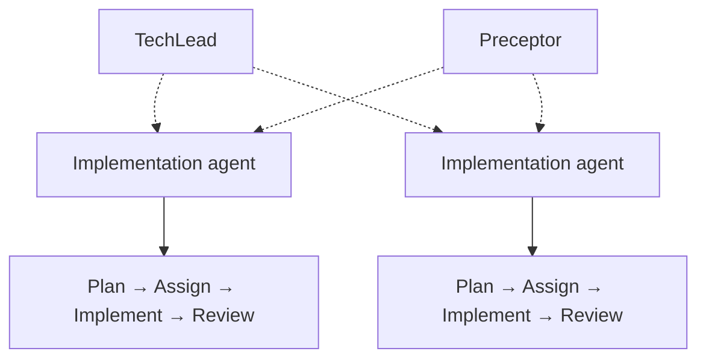

# Agents

## Ownership and documentation gate

- Every implementation file or directory has exactly one owning agent.
- Ownership is exclusive: agents coordinate through `Orchestrator` instead of editing another
	agent's owned path.
- Each change follows this sequence: expected behavior -> implementation -> focused tests ->
	documentation update.
- The `Documentation` agent must update the relevant README, roadmap, architecture, mapping, or
	runbook after the implementation is validated.
- Documentation must distinguish `expected`, `implemented`, `validated`, and `open` behavior.

| Agent | Responsibility |
|---|---|
| TechLead | Direction, sequencing, ownership arbitration, contract changes |
| Preceptor | Method review while work is in progress, and coaching |
| Orchestrator | CLI, reporting, workflow coordination |
| Extractor | Canonical BigQuery model and inventory providers |
| Assessor | Readiness score and evidence-based findings |
| Architect | Component mapping, Fabric strategy, types, migration waves |
| SqlConverter | GoogleSQL compatibility and structured translation |
| FabricGenerator | Dry-run Fabric definitions |
| Deployer | Future packaging and authenticated deployment boundary |
| Reviewer | Fidelity, security, parity, and limitations |
| Tester | Fixtures, contracts, and regressions |
| Documentation | README, roadmap, architecture, mapping references, and runbooks |

This table is enforced: `scripts/validate_agents.py` fails if it does not match the
agent definitions in `.github/agents/`.

## Supervision and escalation

The specialist agents above are a functional decomposition. `TechLead` and `Preceptor`
sit across them, so that "how do I build this" and "should this be built at all" are
answered by different roles.

| Escalate to | When |
|---|---|
| `Preceptor` | Unsure how to verify a change, a test fails after a fix and it is unclear whether it protected the contract or the bug, or a fixture's shape is unconfirmed. |
| `TechLead` | Scope is growing, two agents need the same file, a published contract would change, or a gate stands in the way. |

`Preceptor` reviews method while the work is in progress; `Reviewer` judges the finished
artifact. Neither may weaken a gate to let a change land.

Each implementation path has one owner. Shared changes must be coordinated by Orchestrator.
