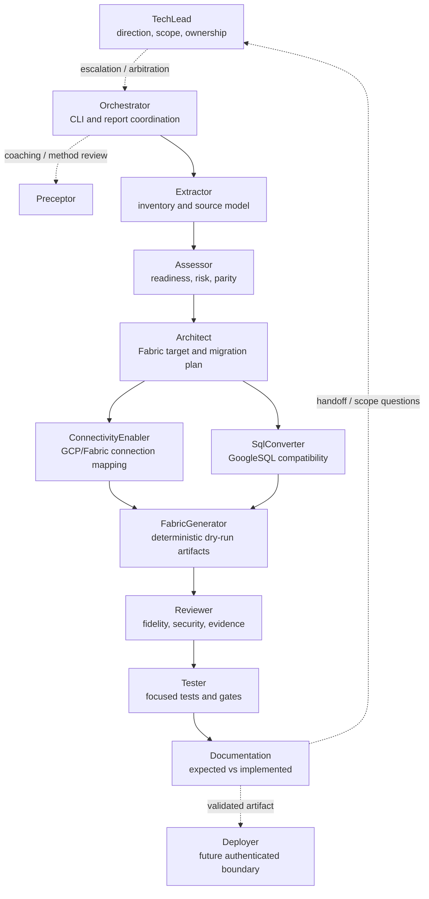

# BQToFabric Agent Workflow

The repository uses one coordination layer and one migration delivery flow.

## Responsibilities

| Agent | Owns | Role in the flow |
|---|---|---|
| `TechLead` | `.github/copilot-instructions.md`, `.github/agent-instructions.md` | Decides whether work should happen, sequencing, ownership, scope, and contract changes. |
| `Orchestrator` | CLI and reporting modules | Coordinates the offline workflow and delegates domain decisions. |
| `Preceptor` | Evidence and triage skills | Reviews method early and coaches against known failure modes. |
| `Extractor` | Inventory, discovery, models, GCP components | Produces traceable source evidence. |
| `Assessor` | Assessment and parity | Scores readiness, risk, compatibility, and evidence quality. |
| `Architect` | Mapping, strategy, planning, type mapping | Chooses explainable Fabric targets and migration waves. |
| `ConnectivityEnabler` | Connection metadata normalization and transcode policy | Maps GCP auth and connection semantics to safe Fabric connection references while blocking secret-bearing output. |
| `SqlConverter` | SQL assessment and compatibility reference | Classifies and translates GoogleSQL constructs. |
| `FabricGenerator` | Generators and templates | Produces deterministic, reviewable, dry-run Fabric artifacts. |
| `Reviewer` | Security and known limitations | Reviews fidelity, security, lineage, unsupported features, and evidence. |
| `Tester` | Tests and agent validator | Protects behavior with focused offline tests and quality gates. |
| `Documentation` | README and migration documentation | Synchronizes expected behavior with validated implementation. |
| `Deployer` | Deployment modules and readiness | Owns the future authenticated deployment boundary; V1 has no live deployment. |

## Working Rules

- One implementation owner per path and file boundary.
- Evidence precedes confidence: unverified behavior remains `not_run`, `unknown`, or `FAIL`.
- Cloud operations stay out of the default path; generated output remains deterministic and dry-run.
- Connection transcode remains a narrow enablement path: it normalizes metadata and safe mapping rules, but never emits raw connection strings or live-authenticated output.
- Implementation changes require focused tests, then a Documentation handoff.
- Scope, ownership, and published-contract changes escalate to `TechLead`.

The editable diagram is [AGENT_WORKFLOW.excalidraw](AGENT_WORKFLOW.excalidraw).
