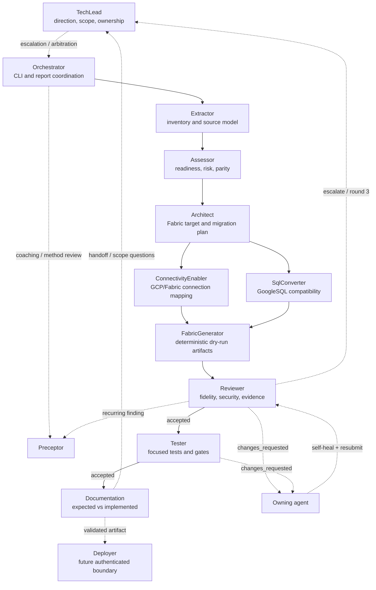
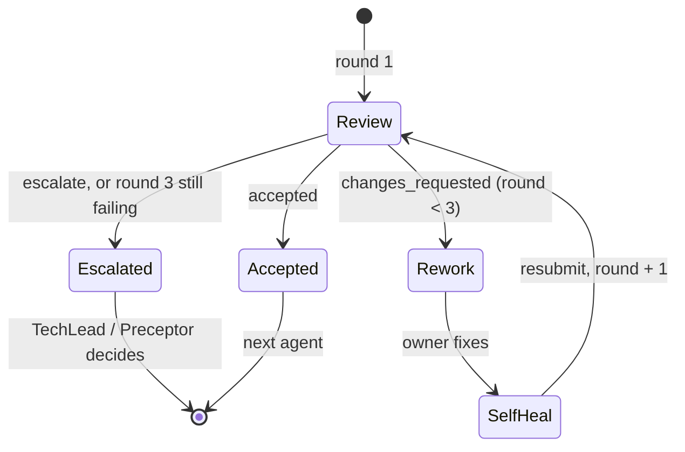

# BQToFabric Agent Workflow

The repository uses one coordination layer and one migration delivery flow.


```mermaid
flowchart TD
    TL[TechLead<br/>direction, scope, ownership] -. escalation / arbitration .-> O[Orchestrator<br/>CLI and report coordination]
    O -. coaching / method review .-> P[Preceptor]
    O --> E[Extractor<br/>inventory and source model]
    E --> A[Assessor<br/>readiness, risk, parity]
    A --> AR[Architect<br/>Fabric target and migration plan]
    AR --> CE[ConnectivityEnabler<br/>GCP/Fabric connection mapping]
    AR --> S[SqlConverter<br/>GoogleSQL compatibility]
    CE --> FG[FabricGenerator<br/>deterministic dry-run artifacts]
    S --> FG
    FG --> R[Reviewer<br/>fidelity, security, evidence]
    R -->|accepted| T[Tester<br/>focused tests and gates]
    T -->|accepted| D[Documentation<br/>expected vs implemented]
    R -. changes_requested .-> OWN[Owning agent]
    T -. changes_requested .-> OWN
    OWN -. self-heal + resubmit .-> R
    R -. escalate / round 3 .-> TL
    R -. recurring finding .-> P
    D -. handoff / scope questions .-> TL
    D -. validated artifact .-> DEP[Deployer<br/>future authenticated boundary]
```

## Responsibilities

| Agent | Owns | Role in the flow |
|---|---|---|
| `TechLead` | `.github/copilot-instructions.md`, `.github/agent-instructions.md` | Decides whether work should happen, sequencing, ownership, scope, and contract changes. |
| `Orchestrator` | CLI and reporting modules | Coordinates the offline workflow and delegates domain decisions. |
| `Preceptor` | Evidence and triage skills | Reviews method early and coaches against known failure modes. |
| `Extractor` | Inventory, discovery, models, GCP components | Produces traceable source evidence. |
| `Assessor` | Assessment and parity | Scores readiness, risk, compatibility, and evidence quality. |
| `Architect` | Mapping, strategy, planning, type mapping | Chooses explainable Fabric targets and migration waves. |
| `ConnectivityEnabler` | Connection metadata normalization and transcode policy | Maps GCP auth and connection semantics to safe Fabric connection references while blocking secret-bearing output. |
| `SqlConverter` | SQL assessment and compatibility reference | Classifies and translates GoogleSQL constructs. |
| `FabricGenerator` | `generator/` and `fabric_artifacts.py` | Produces deterministic, reviewable, dry-run Fabric artifacts. |
| `Reviewer` | Security and known limitations | Reviews fidelity, security, lineage, unsupported features, and evidence. |
| `Tester` | Tests and agent validator | Protects behavior with focused offline tests and quality gates. |
| `Documentation` | README and migration documentation | Synchronizes expected behavior with validated implementation. |
| `Deployer` | Deployment modules and readiness | Owns the future authenticated deployment boundary; V1 has no live deployment. |

## Working Rules

- One implementation owner per path and file boundary.
- Evidence precedes confidence: unverified behavior remains `not_run`, `unknown`, or `FAIL`.
- Cloud operations stay out of the default path; generated output remains deterministic and dry-run.
- Connection transcode remains a narrow enablement path: it normalizes metadata and safe mapping rules, but never emits raw connection strings or live-authenticated output.
- Implementation changes require focused tests, then a Documentation handoff.
- Scope, ownership, and published-contract changes escalate to `TechLead`.

## Feedback loop

`Reviewer` and `Tester` (and `Preceptor` when it reviews in the loop) end every review with a
verdict. `Orchestrator` routes it; the reviewing agent never fixes the finding itself.


```mermaid
stateDiagram-v2
    [*] --> Review: round 1
    Review --> Accepted: accepted
    Review --> Rework: changes_requested (round < 3)
    Rework --> SelfHeal: owner fixes
    SelfHeal --> Review: resubmit, round + 1
    Review --> Escalated: escalate, or round 3 still failing
    Escalated --> [*]: TechLead / Preceptor decides
    Accepted --> [*]: next agent
```

| Verdict | Condition | Route |
|---|---|---|
| `accepted` | No blocking finding and all four gates `passed` | Next agent in the flow |
| `changes_requested` | At least one blocking finding; round 1 or 2 | Owning agent, then back to the same reviewer |
| `escalate` | Ownership, scope, or contract conflict, or round 3 would still need changes | `escalate_to`: `TechLead` or `Preceptor` |

### Self-healing before resubmission

The owner may apply existing deterministic repairs with
`bqtofabric.repair.repair_and_validate(value, rules=..., validator=..., max_passes=n)` before
resubmitting. With `max_passes > 1` the rules run until a pass changes nothing; a value still
changing on the last pass is `manual_review` with `repair did not converge`. The `RepairResult`
is copied into the verdict's `repair` block. A `repaired` result is re-reviewed like any other
change; it is never auto-accepted.

When the same finding `code` or `failure_mode` recurs on two slices, `Preceptor` adds it to its
failure-mode list and, if the defect is mechanical, proposes a new `RepairRule` through
`TechLead`. The rule ships only with a focused test.

### Verdict schema

The contract is [.github/review-verdict.schema.json](../.github/review-verdict.schema.json)
(JSON Schema 2020-12, `schema_version` `1.0`, owned by `TechLead`).

| Field | Type | Required | Meaning |
|---|---|---|---|
| `schema_version` | `"1.0"` | yes | Contract version |
| `slice` | string | yes | Stable identifier of the change under review |
| `reviewer` | `Reviewer` \| `Tester` \| `Preceptor` | yes | Agent issuing the verdict |
| `owner` | string | yes | Owning agent that receives `changes_requested` |
| `round` | integer 1–3 | yes | Review round; round 3 allows only `accepted` or `escalate` |
| `verdict` | `accepted` \| `changes_requested` \| `escalate` | yes | Routing decision |
| `escalate_to` | `TechLead` \| `Preceptor` | when `escalate` | Escalation target |
| `findings[]` | array of finding | yes | Empty allowed for `accepted`; at least one blocking for `changes_requested` |
| `gates` | object | yes | `pytest`, `ruff`, `pyright`, `validate_agents`: `passed` \| `failed` \| `not_run`; all `passed` for `accepted` |
| `repair` | object | no | `status` (`passed` \| `repaired` \| `manual_review`), `applied_rules[]`, `passes` — mirrors `RepairResult` |

Finding fields: `code` (upper snake case, an assessment finding code or a review code),
`severity` (`FAIL` \| `WARN` \| `INFO`), `blocking`, `file` (workspace-relative), optional `line`,
`summary`, optional `failure_mode` (Preceptor heading), and optional `repair_rule` (existing
`RepairRule` name).

```json
{
  "schema_version": "1.0",
  "slice": "p4-wave-scoped-generation",
  "reviewer": "Reviewer",
  "owner": "FabricGenerator",
  "round": 1,
  "verdict": "changes_requested",
  "findings": [
    {
      "code": "PIPELINE_TRIGGER_MISPLACED",
      "severity": "FAIL",
      "blocking": true,
      "file": "src/bqtofabric/fabric_artifacts.py",
      "summary": "Triggers emitted under properties; PipelineValidator rejects the artifact.",
      "failure_mode": "Claiming confidence the evidence does not support",
      "repair_rule": "move_pipeline_triggers"
    }
  ],
  "gates": {"pytest": "passed", "ruff": "passed", "pyright": "passed", "validate_agents": "passed"}
}
```

`scripts/validate_agents.py` enforces the loop: the schema's verdict set, known reviewer names,
a `## Feedback loop` section listing all three verdicts in `Reviewer` and `Tester`, and a
`## Feedback routing` section in `Orchestrator` whose `agents` list reaches every agent.

### Review ledger

`scripts/review_ledger.py` (owned by `Orchestrator`, standard library only) validates verdicts
against the schema and keeps an append-only JSONL ledger, by default
`artifacts/review-ledger.jsonl` (git-ignored, local).

```powershell
python scripts/review_ledger.py check verdict.json    # schema check only
python scripts/review_ledger.py record verdict.json   # check, then append
python scripts/review_ledger.py recurring             # codes on >= 2 distinct slices
```

`record` counts rounds per `slice` and `reviewer`. The first verdict must be round 1; each later
one must follow a `changes_requested`, be exactly one round higher, and keep the same `owner`.
After `accepted` or `escalate` the thread is closed; resumed work uses a new `slice` id.
`recurring` reports blocking finding codes and `failure_mode:<heading>` keys seen on two or more
slices, which is the input `Preceptor` acts on.

The delivery phases and the accountable owner for each phase are maintained in the
[agent execution roadmap](ROADMAP.md#agent-execution-roadmap--next-development-program). Agents
should use that table to choose the next handoff instead of starting an unassigned parallel track.

The editable diagram is [AGENT_WORKFLOW.excalidraw](AGENT_WORKFLOW.excalidraw).
