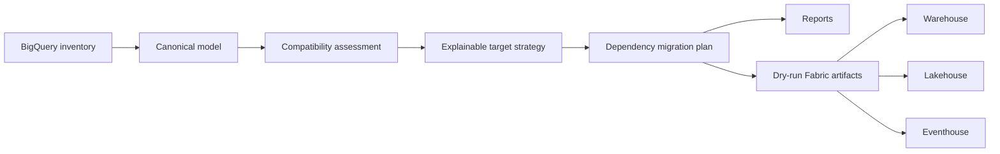

# Architecture

The source model is cloud-independent so assessments and tests run without credentials.
Source identifiers are immutable. Fabric names and targets are recommendations attached to
the plan, not destructive rewrites of source metadata.

## Canonical inventory validation boundary

`JsonInventoryProvider` validates JSON inventories before constructing `BigQueryInventory`. The
pre-coercion boundary requires a non-empty `project_id`, valid non-empty dataset/object/column
identifiers and names, recognized `ObjectKind` values, globally unique source IDs, correctly
shaped column/dependency/clustering arrays, non-empty dependency strings, and column
`name`/`data_type` structures. `size_bytes` is optional evidence: an explicit `null` is valid,
while supplied values must be non-negative integers and cannot be booleans.

This keeps malformed source documents from being hidden by model coercion. The check is local and
deterministic; it does not establish source-schema validity, Fabric compatibility, runtime/data
parity, or deployment authorization.

## Deterministic artifact serialization

`ArtifactGenerator` processes each artifact category in sorted source-ID order. It serializes JSON
artifacts, manifests, and notebooks with sorted keys, and aggregates warnings in source-ID order.
For equivalent inventories, this produces identical generated paths and bytes regardless of input
component ordering. This contract is verified by generating inventories with reversed component
order and comparing every artifact path and byte sequence.

## SQL conversion fidelity boundary

The SQL converter parses GoogleSQL before translation and preserves the existing `DIRECT` result
for supported cases. It detects `SAFE_CAST` and `NOT IN` as semantic-risk constructs, downgrades
the affected conversion to `TRANSFORM`, and emits semantic warnings together with manual parity
steps. This keeps compatibility decisions visible to assessment and planning rather than implying
that a syntactic translation proves equivalent null or membership semantics.

The focused contract was validated with `python -m pytest tests/test_sql_converter.py -v`
(`85 passed`). The check is offline conversion validation only: it does not execute source or
target SQL, validate official Fabric schemas, or establish runtime/data parity. Transformed SQL
requires manual source-versus-target parity testing before migration approval.

Every generated artifact filename combines a filesystem-safe representation of its source ID with
the first 12 hexadecimal characters of that source ID's SHA-256 digest. The suffix is stable and
keeps distinct source IDs from overwriting one another, including IDs that normalize to the same
safe text. Generated manifest paths use these filenames. This is a deterministic dry-run naming
contract, not a deployment or Fabric-schema validation guarantee.

## Generated artifact validation

`validate_artifact` first scans persisted `.json`, `.ipynb`, `.sql`, and `.kql` text with
`CredentialScanner`, then runs the format-specific checks. A credential failure contains only the
finding type, never the matched secret value. `validate_directory` applies the same behavior
recursively to generated subdirectories and also validates notebook structure, JSON structure,
SQL/KQL guards, and pipeline predecessor references. It then compares target-manifest entries with
the generated artifact manifest, checks that each referenced generated path exists, and rejects a
non-review target that references an artifact marked `valid: false`. Invalid artifacts referenced
by an intentional review-only target remain allowed.

The focused validation contract was checked with `python -m pytest tests/test_artifact_validation.py
tests/test_security.py -v` (`10 passed`). This is offline pattern and structural validation;
pattern scanning is not official Fabric schema validation and does not validate deployment. The
full suite was validated with `python -m pytest -q` (`306 passed`); all checks remain offline-only.

## CLI and deployment-readiness failure contract

Local workflow guards fail closed and use deterministic results: a missing inventory returns exit
code `2`; malformed inventory returns exit code `5`; and tampered deployment-manifest verification
returns exit code `5`. `deployment-check` blocks invalid artifact validation. Readiness blocks plans
with unresolved dependencies or unsupported target components. These guards operate on local dry-run
artifacts and do not perform cloud operations.

This contract was validated with `python -m pytest tests/test_cli.py
tests/test_deployment_readiness.py -v` (`14 passed`). It remains offline-only and does not validate
official Fabric schemas or APIs, execute workloads, establish runtime or data parity, or authorize
deployment.

## Composer schedule contract

Offline Composer normalization writes `properties.schedule_interval` as the canonical DAG schedule
field and retains `properties.schedule` for inventory compatibility. Pipeline artifact generation
reads `schedule_interval` first and falls back to `schedule`, so legacy inventories continue to
map `@daily`, `@hourly`, and `@weekly` to their corresponding Fabric pipeline triggers. Raw cron
expressions are not automatically mapped and remain review-required. This preserves source
intent without representing a raw cron schedule as a verified Fabric trigger.

## Composer adapter-evidence contract

Offline Composer DAG normalization writes `properties.runtime_version` from the Composer image
version when present; otherwise it uses the sanitized environment-version label, then `unknown`.
It also records declared task connection names in `properties.connections`, accepting
`conn_id`, `connection_id`, `gcp_conn_id`, and `google_cloud_conn_id`. Connection configuration,
secret material, and access bindings are never serialized. An explicit `connections: []` means no
task declared a connection and is complete Composer evidence; an absent `connections` field remains
incomplete evidence for assessment.

This boundary records static declaration evidence only. It does not establish the effective
connection configuration, secret bindings, or runtime access. Those require manual review.

## Dataproc adapter-evidence contract

Dataproc job normalization writes canonical `properties.language`: PySpark jobs map to `python`,
Spark SQL and Hive jobs map to `sql`, and Pig jobs map to `pig`. Unsupported or ambiguous job types
map to `unknown`. Existing `properties.runtime` job classification is preserved.

`properties.runtime_version` is inherited from the referenced cluster's
`config.softwareConfig.imageVersion` when the cluster payload provides it; otherwise it is
`unknown`. Assessment treats `unknown` and `not specified` as missing evidence, not as complete
runtime evidence. A job with an unknown runtime version must be supplied with that evidence or
re-discovered from a payload containing the referenced cluster's `imageVersion` before readiness
can be complete.

Each canonical object carries `discovered_from` as acquisition evidence. Imported canonical JSON
defaults to `inventory`; the live BigQuery provider stamps `bigquery_api`; and external GCP payloads
normalized for offline assessment stamp `external_payload`. Assessment preserves this value in each
object's `evidence_summary` and produces deterministic source counts in `discovery_coverage`. The
field distinguishes collection paths, not metadata freshness or the existence of a live adapter.

When an `external_payload` component lacks required offline evidence, assessment emits exactly one
`FAIL` `EXTERNAL_PAYLOAD_INCOMPLETE_ADAPTER` finding in category `adapter`. The finding requires
the supplied evidence to be completed because no live adapter exists. The dependency planner then
marks that component and every direct or transitive dependent `manual_review`. This is a planning
review state, not an unresolved dependency; `unresolved_dependencies` is reserved for missing or
external source IDs and dependency cycles.

`manual_review` is the PlanItem decision flag. A flagged item also records deterministic
`manual_review_reasons` to make the review actionable. The supported codes are
`external_dependency`, `incompatible_mapping`, `streaming_downstream_review`,
`incomplete_external_adapter`, `depends_on_incomplete_external_adapter`, `sql_incompatibility`,
`incomplete_dataform_compilation`, `depends_on_incomplete_dataform_compilation`, and
`cycle_or_unresolved_dependency`. The report renderer exposes these values in
`migration-plan.md`; the generated target manifest exposes them as `manualReview` and
`manualReviewReasons`. These are dry-run planning fields and do not alter cloud behavior.

For each successfully fetched Dataform compilation result, discovery aggregates `models`,
`assertions`, and `incremental` into the canonical repository and workflow records. `models` is a
sorted list of compiled table/view target names; `assertions` and `incremental` are booleans
derived from compiled targets and edges. `models: []`, `assertions: false`, and
`incremental: false` are known evidence, rather than incomplete discovery.

If a Dataform compilation-result detail request fails, discovery instead emits a deterministic
`dataform_workflow` fallback with `discovered_from: dataform_api`, `discovery_incomplete: true`,
and `lineage_status: unavailable`, preserving incomplete discovery evidence rather than silently
dropping lineage. Assessment emits `FAIL` `DATAFORM_COMPILATION_DETAILS_UNAVAILABLE`; planning
marks the fallback `incomplete_dataform_compilation` and its downstream objects
`depends_on_incomplete_dataform_compilation`. Re-run discovery after API or access recovery to
obtain the actual compilation graph. The successful and failed-result paths were validated with
`python -m pytest tests/test_discovery.py tests/test_assessment.py tests/test_dataform_conversion.py
-v` (`56 passed`).

The report renderer also carries assessment findings into `migration-plan.md`. The generated
Markdown report includes a `Findings` section with each finding's severity, code, category, source,
and message. This makes `WARN` and `FAIL` conditions visible in the human review artifact, but it is
still dry-run evidence and does not prove remediation, deployment readiness, or runtime parity.

The target manifest also has a top-level `stageReadiness` object. It contains one summary for
each `processingStage` represented by an entry and omits absent stages. Each summary records
`total`, compatibility counts (`direct`, `transform`, `redesign`, `unsupported`), `manualReview`,
and `readiness`. The latter is a deterministic rounded compatibility-weight average per component:
`direct=100`, `transform=80`, `redesign=50`, and `unsupported=0`. This aggregation prioritizes
migration review; it is not proof of execution, parity, security remediation, or deployment
readiness.

## Live discovery boundary

The optional live provider uses user Application Default Credentials with the
`https://www.googleapis.com/auth/bigquery.readonly` scope. It calls BigQuery dataset, table,
routine, model, and job resources, plus BigQuery Data Transfer `transferConfigs` and BigQuery
Connection `connections`. Dataset GET `access` entries are redacted and normalized into canonical
`security_policy` records with `evidence_scope: dataset_access_entry`. Assessment emits `FAIL`
`SECURITY_EFFECTIVE_ACCESS_REVIEW`, because that evidence cannot establish effective project,
organization, group, or inherited IAM access and requires manual security review. This requires the
BigQuery API, BigQuery Data Transfer API, and BigQuery Connection API; see the [migration runbook](MIGRATION_RUNBOOK.md)
for the permission matrix.

The provider makes no IAM API calls and does not call Cloud Resource Manager IAM policy APIs,
connection `getIamPolicy`, or the BigQuery Data Policy API. The optional Dataflow adapter makes
read-only regional job-list calls only for explicitly requested regions; it does not scan all
regions and does not extract IAM. Consequently, project/org IAM, connection IAM, distinct row
access policies, data policies, policy tags, and the remaining external GCP families are
canonical/offline assessment inputs rather than live extraction results.
Missing security-policy coverage requires security review; it cannot be inferred from the discovered
metadata.

The V1 boundary ends at generated review artifacts. A future provider can inventory live
BigQuery through Application Default Credentials, and another can deploy approved definitions
through Fabric APIs. Both must remain opt-in and dry-run by default.
