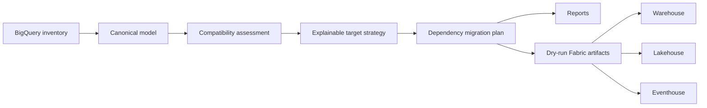
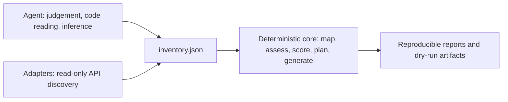

# Architecture

The source model is cloud-independent so assessments and tests run without credentials.
Source identifiers are immutable. Fabric names and targets are recommendations attached to
the plan, not destructive rewrites of source metadata.

## Model-free core boundary

The assessment core is deterministic and has no language-model dependency. Its only runtime
dependency is `sqlglot`; `google-auth` and `requests` are confined to the optional `gcp`
extra and imported lazily, so the package installs and runs without them.

This is enforced, not merely intended. `tests/test_core_boundaries.py` fails if any module
imports an LLM or inference library, if a third-party import appears outside the declared
surface, if `pyproject.toml` declares a model client, or if an optional dependency leaks to
module level.

A language model may sit **on top of** the tool — driving the CLI, reading reports, or
supplying inferred evidence marked `discovered_from: assisted` — but never inside it. The
canonical inventory is the seam:

Everything upstream of the inventory may be non-deterministic. Everything downstream is
pure and testable, which is what allows a finding to be reproduced and a sign-off to mean
something. Inference supplies evidence; the engine still derives the verdict, and
`assisted` provenance keeps that distinction visible in `discoveryCoverage`.

## Canonical inventory validation boundary

`JsonInventoryProvider` validates JSON inventories before constructing `BigQueryInventory`. The
pre-coercion boundary requires a non-empty `project_id`, valid non-empty dataset/object/column
identifiers and names, recognized `ObjectKind` values, globally unique source IDs, correctly
shaped column/dependency/clustering arrays, non-empty dependency strings, and column
`name`/`data_type` structures. `size_bytes` is optional evidence: an explicit `null` is valid,
while supplied values must be non-negative integers and cannot be booleans.

This keeps malformed source documents from being hidden by model coercion. The check is local and
deterministic; it does not establish source-schema validity, Fabric compatibility, runtime/data
parity, or deployment authorization.

## Deterministic artifact serialization

`ArtifactGenerator` processes each artifact category in sorted source-ID order. It serializes JSON
artifacts, manifests, and notebooks with sorted keys, and aggregates warnings in source-ID order.
For equivalent inventories, this produces identical generated paths and bytes regardless of input
component ordering. This contract is verified by generating inventories with reversed component
order and comparing every artifact path and byte sequence.

## Connectivity transcode boundary

`connectivity.transcode_connection` is the narrow boundary between connection mapping and report
generation. It reuses the canonical mapping decision and credential scanner, then emits only a
stable reference name, target type, compatibility, status, redaction verdict, findings, and safe
actions. `write_reports` serializes these records to `connection-transcode.json` in dry-run mode.
No connection is created, no identity is resolved, and no secret-bearing value is persisted.

Known credential material or unsupported backends fail closed to `manual_review`.

## Offline repair boundary

`repair.repair_and_validate` applies ordered `RepairRule` instances to a defensive copy and runs a
validator after the rules. A successful changed value is marked `repaired`; a failed validator or
validator exception is `manual_review`. Current domain rules move misplaced pipeline `triggers` and
remove exact duplicate schema fields recursively. Same-name conflicting definitions are preserved,
not guessed or renamed. Repairs are opt-in and do not rewrite persisted inventories or artifacts.

## SQL conversion boundary

There is one SQL conversion stack. `sql_assessment` delegates to the `converter/` package
(`SqlConverter`), so the `converter/` package is reachable production code rather than a parallel
unused implementation, and assessment cannot disagree with generation about a conversion verdict.

The converter parses GoogleSQL before translation. SQL compatibility is the worst of three inputs
and never defaults to `direct`:

1. the converter verdict for the target dialect,
2. the detected semantic risks, such as `SAFE_CAST` and `NOT IN`, and
3. the mapping decision for the owning object.

A non-SQL routine body, such as a JavaScript UDF, resolves to `redesign` and emits no converted
SQL, so there is nothing to mistake for a translation. Semantic-risk constructs emit warnings and
manual parity steps, keeping the compatibility decision visible to assessment and planning rather
than implying that a syntactic translation proves equivalent null or membership semantics.

The focused contract is validated by `python -m pytest tests/test_sql_converter.py`, which passes
in CI. The check is offline conversion validation only: it does not execute source or target SQL,
validate official Fabric schemas, or establish runtime/data parity. Transformed SQL requires manual
source-versus-target parity testing before migration approval.

## Assessment scoring boundary

The readiness score is computed per component. Type risk and SQL risk fold into the component that
owns them rather than being aggregated separately, the score is scaled by that component's evidence
coverage, and a component carrying a `FAIL` blocker scores zero. Schema width does not contribute.

Type findings are attributable: a finding's `source_id` is the owning object, not the bare type
name, and assessment emits one finding per distinct type per object listing the affected column
paths.

This makes the score a function of recorded evidence and recorded blockers. It is not a measured
or runtime readiness signal.

## Strategy selection boundary

Candidate targets are weighted by mapping compatibility (`direct` 3, `transform` 2, `redesign` 1,
`unsupported` 0) rather than by target identity. The `data_target` preference signal is symmetric
for Warehouse and Lakehouse. Multi-table transactions pin Warehouse as a hard constraint rather
than a weighted signal. A tie-break is recorded as an explicit signal, and `scores` reports only
the three candidate primary targets.

## Parity boundary

Parity status is recomputed from evidence on every run; a caller-supplied `status` is never
trusted. Each check is derived from its own `source`/`target` payload, a declared `passed` with no
payload resolves to `not_run`, and a declared status that contradicts the computed result is
preserved as `declaredStatus`. The `type` check was removed because no comparator backed it,
leaving `schema`, `row_count`, `checksum`, `aggregate`, `null_distribution`, `sample`, and
`sql_result`. Applicability is keyed on data-bearing kind rather than on captured columns.

All comparisons consume supplied evidence. No source or Fabric query is executed.

Every generated artifact filename combines a filesystem-safe representation of its source ID with
the first 12 hexadecimal characters of that source ID's SHA-256 digest. The suffix is stable and
keeps distinct source IDs from overwriting one another, including IDs that normalize to the same
safe text. Generated manifest paths use these filenames and POSIX separators, so generated output
is byte-identical across Windows and Linux. This is a deterministic dry-run naming contract, not a
deployment or Fabric-schema validation guarantee.

## Generated artifact validation

An artifact's `valid` flag is derived from a real content check rather than asserted by the
generator. `NotebookValidator` rejects undefined DataFrame references. `TsqlValidator` strips
comments and re-parses `CREATE TABLE`, rejects `#` comments, and enforces the `CREATE SCHEMA` batch
rule. `PipelineValidator` requires name-keyed parameters and variables, rejects `triggers` as a
pipeline property, and rejects secret-bearing expressions.

Generated Warehouse view bodies are converted GoogleSQL → T-SQL. When conversion fails or produces
constructs Fabric Warehouse does not support, the body is omitted, the artifact is marked invalid,
and the candidate conversion is emitted as `--` comments for review. Generated pipelines carry named
connection references bound to managed identity instead of connection strings, and `triggers` sits
beside `properties` because triggers are separate Fabric resources.

`validate_artifact` first scans persisted `.json`, `.ipynb`, `.sql`, and `.kql` text with
`CredentialScanner`, then runs the format-specific checks. A credential failure contains only the
finding type, never the matched secret value. `validate_directory` applies the same behavior
recursively to generated subdirectories and also validates notebook structure, JSON structure,
SQL/KQL guards, and pipeline predecessor references. It then compares target-manifest entries with
the generated artifact manifest, checks that each referenced generated path exists, and rejects a
non-review target that references an artifact marked `valid: false`. Invalid artifacts referenced
by an intentional review-only target remain allowed.

Validation runs after every artifact is written, so `parity-evidence.json` and
`deployment-manifest.json` are covered by the credential scan and the structural checks rather than
escaping them.

The focused validation contract is checked by `python -m pytest tests/test_artifact_validation.py
tests/test_security.py`, which passes in CI. This is offline pattern and structural validation;
pattern scanning is not official Fabric schema validation and does not validate deployment.

## Assessment report summary contract

`write_reports` emits `assessment-summary.json` alongside the detailed `assessment.json`. The
summary is deterministic and shaped for dashboard and HTML report consumers. It contains
`projectId`, `score`, `evidenceCoverage`, `architecture`, `componentCount`, `findingCounts`,
`targetSummary`, `compatibilitySummary`, `discoveryCoverage`, `paritySummary`, `manualReviewCount`,
`manualReviewReasons`, `unresolvedDependencies`, `blockers`, and `status`.

`assessment.json` remains the detailed assessment contract and is not replaced by the summary.
The summary is a local presentation rollup, not a new assessment authority: it does not call cloud
services, validate official Fabric schemas, execute workloads, establish runtime or data parity,
or authorize deployment.

This milestone is validated by `python -m pytest tests/test_cli.py
tests/test_deployment_readiness.py`, which passes in CI.

## CLI and deployment-readiness failure contract

Local workflow guards fail closed and use deterministic results: a missing inventory returns exit
code `2`; malformed inventory returns exit code `5`; and tampered deployment-manifest verification
returns exit code `5`. `deployment-check` blocks on invalid artifact validation, `FAIL` findings and
recorded blockers, failed parity, `redesign` components, unsupported target components, pending
manual review, and unresolved dependencies. These guards operate on local dry-run artifacts and do
not perform cloud operations.

This contract is validated by `python -m pytest tests/test_cli.py
tests/test_deployment_readiness.py`, which passes in CI. It remains offline-only and does not
validate official Fabric schemas or APIs, execute workloads, establish runtime or data parity, or
authorize deployment.

## Composer schedule contract

Composer normalization writes `properties.schedule_interval` as the canonical DAG schedule
field and retains `properties.schedule` for inventory compatibility. Pipeline artifact generation
reads `schedule_interval` first and falls back to `schedule`, so legacy inventories continue to
map `@daily`, `@hourly`, and `@weekly` to their corresponding Fabric pipeline triggers. Raw cron
expressions are not automatically mapped and remain review-required. This preserves source
intent without representing a raw cron schedule as a verified Fabric trigger.

## Composer adapter-evidence contract

Composer DAG normalization writes `properties.runtime_version` from the Composer image
version when present; otherwise it uses the sanitized environment-version label, then `unknown`.
It also records declared task connection names in `properties.connections`, accepting
`conn_id`, `connection_id`, `gcp_conn_id`, and `google_cloud_conn_id`. Connection configuration,
secret material, and access bindings are never serialized. An explicit `connections: []` means no
task declared a connection and is complete Composer evidence; an absent `connections` field remains
incomplete evidence for assessment.

This boundary records static declaration evidence only. It does not establish the effective
connection configuration, secret bindings, or runtime access. Those require manual review.

## Dataproc adapter-evidence contract

Dataproc job normalization writes canonical `properties.language`: PySpark jobs map to `python`,
Spark SQL and Hive jobs map to `sql`, and Pig jobs map to `pig`. Unsupported or ambiguous job types
map to `unknown`. Existing `properties.runtime` job classification is preserved.

`properties.runtime_version` is inherited from the referenced cluster's
`config.softwareConfig.imageVersion` when the cluster payload provides it; otherwise it is
`unknown`. Assessment treats `unknown` and `not specified` as missing evidence, not as complete
runtime evidence. A job with an unknown runtime version must be supplied with that evidence or
re-discovered from a payload containing the referenced cluster's `imageVersion` before readiness
can be complete.

Each canonical object carries `discovered_from` as acquisition evidence. The canonical values are
`inventory` (imported canonical JSON, the default), `bigquery_api`, `dataflow_api`, `composer_api`,
`dataproc_api`, `dataform_api`, and `external_payload`. Assessment preserves this value in each
object's `evidence_summary` and produces deterministic source counts in `discovery_coverage`. The
field distinguishes collection paths, not metadata freshness.

When an `external_payload` component lacks required offline evidence, assessment emits exactly one
`FAIL` `EXTERNAL_PAYLOAD_INCOMPLETE_ADAPTER` finding in category `adapter`. The finding requires
the supplied evidence to be completed because the component was supplied rather than discovered.
The dependency planner then
marks that component and every direct or transitive dependent `manual_review`. This is a planning
review state, not an unresolved dependency; `unresolved_dependencies` is reserved for missing or
external source IDs and dependency cycles.

`manual_review` is the PlanItem decision flag. A flagged item also records deterministic
`manual_review_reasons` to make the review actionable, and reasons are recorded independently so
one item can carry several rather than only the first matching condition. There are 12 codes;
their triggers are tabulated in the
[mapping reference](MAPPING_REFERENCE.md#manual-review-decision-contract). The report renderer
exposes these values in `migration-plan.md`; the generated target manifest exposes them as
`manualReview` and `manualReviewReasons`. These are dry-run planning fields and do not alter cloud
behavior.

For each successfully fetched Dataform compilation result, discovery aggregates `models`,
`assertions`, and `incremental` into the canonical repository and workflow records. `models` is a
sorted list of compiled table/view target names; `assertions` and `incremental` are booleans
derived from compiled targets and edges. `models: []`, `assertions: false`, and
`incremental: false` are known evidence, rather than incomplete discovery.

If a Dataform compilation-result detail request fails, discovery instead emits a deterministic
`dataform_workflow` fallback with `discovered_from: dataform_api`, `discovery_incomplete: true`,
and `lineage_status: unavailable`, preserving incomplete discovery evidence rather than silently
dropping lineage. Assessment emits `FAIL` `DATAFORM_COMPILATION_DETAILS_UNAVAILABLE`; planning
marks the fallback `incomplete_dataform_compilation` and its downstream objects
`depends_on_incomplete_dataform_compilation`. Re-run discovery after API or access recovery to
obtain the actual compilation graph. The successful and failed-result paths are validated by
`python -m pytest tests/test_discovery.py tests/test_assessment.py tests/test_dataform_conversion.py`,
which passes in CI.

The report renderer also carries assessment findings into `migration-plan.md`. The generated
Markdown report includes a `Findings` section with each finding's severity, code, category, source,
and message. This makes `WARN` and `FAIL` conditions visible in the human review artifact, but it is
still dry-run evidence and does not prove remediation, deployment readiness, or runtime parity.

The target manifest also has a top-level `stageReadiness` object. It contains one summary for
each `processingStage` represented by an entry and omits absent stages. Each summary records
`total`, compatibility counts (`direct`, `transform`, `redesign`, `unsupported`), `manualReview`,
and `readiness`. The latter is a deterministic rounded compatibility-weight average per component:
`direct=100`, `transform=80`, `redesign=50`, and `unsupported=0`. This aggregation prioritizes
migration review; it is not proof of execution, parity, security remediation, or deployment
readiness.

## Live discovery boundary

The optional live BigQuery provider uses user Application Default Credentials with the
`https://www.googleapis.com/auth/bigquery.readonly` scope. It calls BigQuery dataset, table,
routine, model, and job resources, plus BigQuery Data Transfer `transferConfigs` and BigQuery
Connection `connections`. Dataset GET `access` entries are redacted, their principal identities are
pseudonymized as stable non-reversible `principal:<12 hex>` values, and the result is normalized
into canonical `security_policy` records with `evidence_scope: dataset_access_entry`. Assessment
emits `FAIL` `SECURITY_EFFECTIVE_ACCESS_REVIEW`, because that evidence cannot establish effective
project, organization, group, or inherited IAM access and requires manual security review. This
requires the BigQuery API, BigQuery Data Transfer API, and BigQuery Connection API; see the
[migration runbook](MIGRATION_RUNBOOK.md) for the permission matrix.

Four additional opt-in read-only live adapters exist — Dataflow, Dataproc, Dataform, and Composer.
Each is enabled only by an explicit CLI flag, and each requests
`https://www.googleapis.com/auth/cloud-platform.read-only`, which is broader than the BigQuery
scope. Regional adapters act only on explicitly requested regions and never scan all regions.
Paging is bounded and rejects repeated page tokens. **None of the adapters, including the BigQuery
path, has been validated against an authorized GCP sandbox:** the adapter code exists and is
covered by offline fixture tests; the live verification does not exist.

No adapter makes IAM API calls. None calls Cloud Resource Manager IAM policy APIs, connection
`getIamPolicy`, or the BigQuery Data Policy API. Consequently, project/org IAM, connection IAM,
distinct row access policies, data policies, and policy tags are not extracted. Workflows, Pub/Sub,
GCS, Looker, Vertex AI, Dataplex, Cloud SQL, and Spanner have no live adapter and remain
canonical/offline assessment inputs.
Missing security-policy coverage requires security review; it cannot be inferred from the discovered
metadata.

The V1 boundary ends at generated review artifacts. A future provider can inventory live
BigQuery through Application Default Credentials, and another can deploy approved definitions
through Fabric APIs. Both must remain opt-in and dry-run by default.
