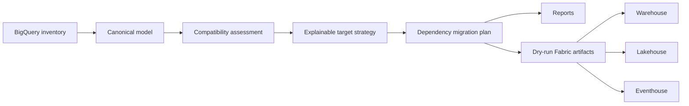

# Architecture

The source model is cloud-independent so assessments and tests run without credentials.
Source identifiers are immutable. Fabric names and targets are recommendations attached to
the plan, not destructive rewrites of source metadata.

## Live discovery boundary

The optional live provider uses user Application Default Credentials with the
`https://www.googleapis.com/auth/bigquery.readonly` scope. It calls BigQuery dataset, table,
routine, model, and job resources, plus BigQuery Data Transfer `transferConfigs` and BigQuery
Connection `connections`. Dataset GET `access` entries are redacted and normalized into canonical
`security_policy` records. This requires the BigQuery API, BigQuery Data Transfer API, and BigQuery
Connection API; see the [migration runbook](MIGRATION_RUNBOOK.md) for the permission matrix.

The provider does not call Cloud Resource Manager IAM policy APIs, connection `getIamPolicy`, the
BigQuery Data Policy API, or external GCP service APIs. Consequently, project IAM, connection IAM,
row access policies, data policies, policy tags, and the external GCP families are canonical/offline
assessment inputs rather than live extraction results. Missing security-policy coverage requires
security review; it cannot be inferred from the discovered metadata.

The V1 boundary ends at generated review artifacts. A future provider can inventory live
BigQuery through Application Default Credentials, and another can deploy approved definitions
through Fabric APIs. Both must remain opt-in and dry-run by default.
