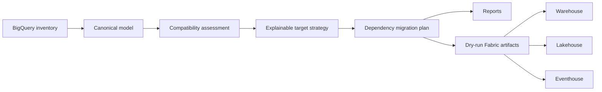

# Architecture

The source model is cloud-independent so assessments and tests run without credentials.
Source identifiers are immutable. Fabric names and targets are recommendations attached to
the plan, not destructive rewrites of source metadata.

The V1 boundary ends at generated review artifacts. A future provider can inventory live
BigQuery through Application Default Credentials, and another can deploy approved definitions
through Fabric APIs. Both must remain opt-in and dry-run by default.
