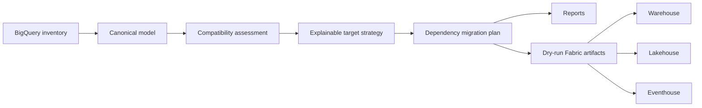

# Architecture

The source model is cloud-independent so assessments and tests run without credentials.
Source identifiers are immutable. Fabric names and targets are recommendations attached to
the plan, not destructive rewrites of source metadata.

Each canonical object carries `discovered_from` as acquisition evidence. Imported canonical JSON
defaults to `inventory`; the live BigQuery provider stamps `bigquery_api`; and external GCP payloads
normalized for offline assessment stamp `external_payload`. Assessment preserves this value in each
object's `evidence_summary` and produces deterministic source counts in `discovery_coverage`. The
field distinguishes collection paths, not metadata freshness or the existence of a live adapter.

When an `external_payload` component lacks required offline evidence, assessment emits exactly one
`FAIL` `EXTERNAL_PAYLOAD_INCOMPLETE_ADAPTER` finding in category `adapter`. The finding requires
the supplied evidence to be completed because no live adapter exists. The dependency planner then
marks that component and every direct or transitive dependent `manual_review`. This is a planning
review state, not an unresolved dependency; `unresolved_dependencies` is reserved for missing or
external source IDs and dependency cycles.

`manual_review` is the PlanItem decision flag. A flagged item also records deterministic
`manual_review_reasons` to make the review actionable. The supported codes are
`external_dependency`, `incompatible_mapping`, `streaming_downstream_review`,
`incomplete_external_adapter`, `depends_on_incomplete_external_adapter`, `sql_incompatibility`,
and `cycle_or_unresolved_dependency`. The report renderer exposes these values in
`migration-plan.md`; the generated target manifest exposes them as `manualReview` and
`manualReviewReasons`. These are dry-run planning fields and do not alter cloud behavior.

The report renderer also carries assessment findings into `migration-plan.md`. The generated
Markdown report includes a `Findings` section with each finding's severity, code, category, source,
and message. This makes `WARN` and `FAIL` conditions visible in the human review artifact, but it is
still dry-run evidence and does not prove remediation, deployment readiness, or runtime parity.

The target manifest also has a top-level `stageReadiness` object. It contains one summary for
each `processingStage` represented by an entry and omits absent stages. Each summary records
`total`, compatibility counts (`direct`, `transform`, `redesign`, `unsupported`), `manualReview`,
and `readiness`. The latter is a deterministic rounded compatibility-weight average per component:
`direct=100`, `transform=80`, `redesign=50`, and `unsupported=0`. This aggregation prioritizes
migration review; it is not proof of execution, parity, security remediation, or deployment
readiness.

## Live discovery boundary

The optional live provider uses user Application Default Credentials with the
`https://www.googleapis.com/auth/bigquery.readonly` scope. It calls BigQuery dataset, table,
routine, model, and job resources, plus BigQuery Data Transfer `transferConfigs` and BigQuery
Connection `connections`. Dataset GET `access` entries are redacted and normalized into canonical
`security_policy` records with `evidence_scope: dataset_access_entry`. Assessment emits `FAIL`
`SECURITY_EFFECTIVE_ACCESS_REVIEW`, because that evidence cannot establish effective project,
organization, group, or inherited IAM access and requires manual security review. This requires the
BigQuery API, BigQuery Data Transfer API, and BigQuery Connection API; see the [migration runbook](MIGRATION_RUNBOOK.md)
for the permission matrix.

The provider makes no IAM API calls and does not call Cloud Resource Manager IAM policy APIs,
connection `getIamPolicy`, or the BigQuery Data Policy API. The optional Dataflow adapter makes
read-only regional job-list calls only for explicitly requested regions; it does not scan all
regions and does not extract IAM. Consequently, project/org IAM, connection IAM, distinct row
access policies, data policies, policy tags, and the remaining external GCP families are
canonical/offline assessment inputs rather than live extraction results.
Missing security-policy coverage requires security review; it cannot be inferred from the discovered
metadata.

The V1 boundary ends at generated review artifacts. A future provider can inventory live
BigQuery through Application Default Credentials, and another can deploy approved definitions
through Fabric APIs. Both must remain opt-in and dry-run by default.
