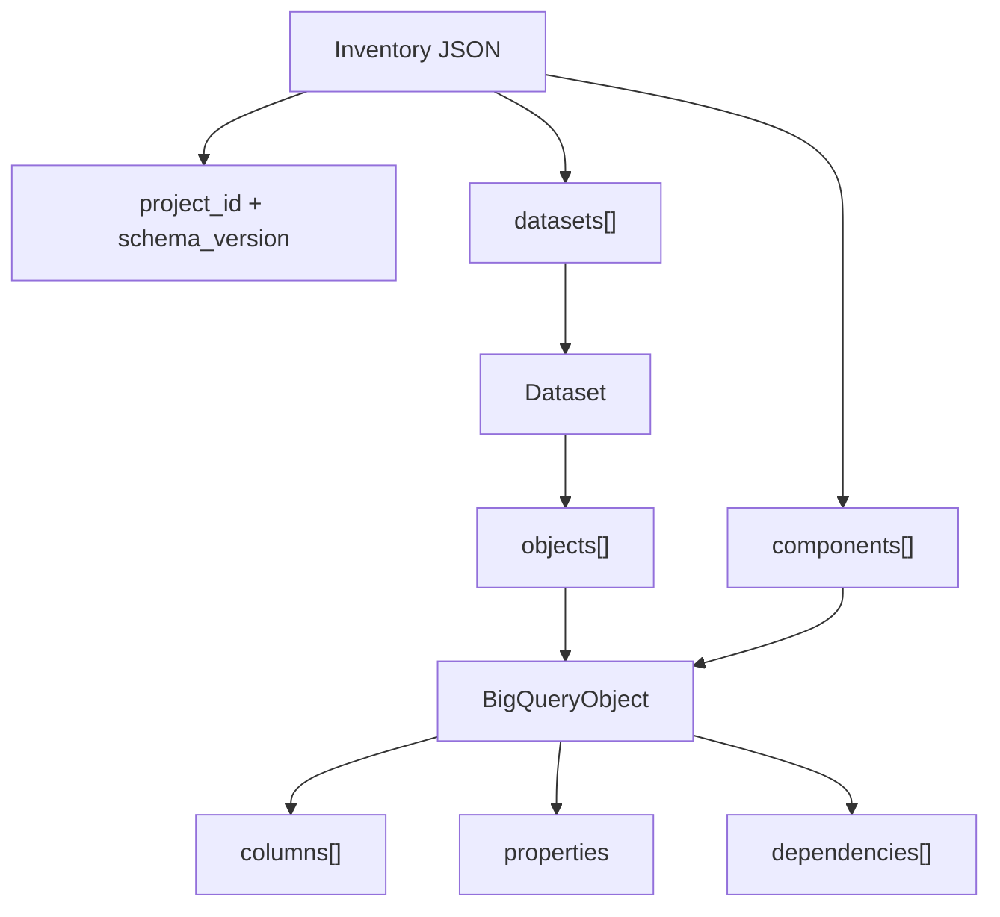

# Inventory Schema Guide

BQToFabric consumes a canonical JSON inventory. The inventory is cloud-independent: discovery adapters and hand-authored fixtures must produce the same shape before assessment begins.

## Shape at a Glance



## Minimal Inventory

```json
{
  "project_id": "demo-project",
  "schema_version": "1.1",
  "datasets": [],
  "components": [
    {
      "source_id": "demo-project.analytics.orders",
      "name": "orders",
      "kind": "table",
      "dataset": "analytics",
      "columns": [
        {
          "name": "order_id",
          "data_type": "STRING",
          "nullable": false,
          "mode": "REQUIRED"
        }
      ],
      "dependencies": [],
      "properties": {}
    }
  ],
  "metadata": {}
}
```

## Top-Level Fields

| Field | Required | Meaning |
|---|---:|---|
| `project_id` | Yes | Stable source project identifier |
| `schema_version` | No | Canonical inventory version; defaults to `1.0` when omitted |
| `datasets` | No | BigQuery datasets containing nested objects |
| `components` | No | Cross-dataset or ecosystem objects such as jobs, streams, and DAGs |
| `metadata` | No | Preferences and provenance-safe configuration |

## Dataset Fields

| Field | Required | Meaning |
|---|---:|---|
| `source_id` | Yes | Immutable dataset identifier, normally `project.dataset` |
| `name` | Yes | Dataset name |
| `location` | No | Source region or multi-region; defaults to `unknown` when omitted |
| `objects` | No | Ordered `BigQueryObject` entries owned by the dataset |
| `labels` | No | Non-secret dataset labels |

A dataset's `source_id` participates in the same global uniqueness check as object and component
`source_id` values.

## Object Fields

| Field | Required | Meaning |
|---|---:|---|
| `source_id` | Yes | Immutable globally meaningful source identifier |
| `name` | Yes | Source object name |
| `kind` | Yes | `ObjectKind` value such as `table`, `view`, `spark_job`, or `composer_dag` |
| `discovered_from` | No | Provenance value; defaults to `inventory` |
| `dataset` | No | Owning BigQuery dataset |
| `columns` | No | Ordered column metadata, including nested `fields` |
| `sql` | No | Source SQL or procedure body |
| `dependencies` | No | Source IDs or explicit external references |
| `partition_field` | No | Recorded source partitioning field |
| `clustering_fields` | No | Recorded source clustering fields |
| `size_bytes` | No | Recorded source size; used only for review recommendations |
| `labels` | No | Non-secret source labels |
| `properties` | No | Workload-specific evidence and adapter metadata |

## Column Fields

| Field | Required | Meaning |
|---|---:|---|
| `name` | Yes | Column name; non-empty string |
| `data_type` | Yes | Source type name; non-empty string |
| `nullable` | No | Defaults to `true` |
| `mode` | No | Source mode; defaults to `NULLABLE` |
| `description` | No | Source column description; carried through for review and semantic-model authoring |
| `fields` | No | Nested `Column` entries for `STRUCT` and `RECORD` types; recursive and validated as an array |

Nested `fields` are how `STRUCT`, `RECORD`, and repeated nested shapes are represented. Type
findings report the affected column paths, so nested detail is what makes a `TYPE_REDESIGN` or
`TYPE_UNSUPPORTED` finding actionable.

## `discovered_from` Values

`discovered_from` records how a component entered the inventory. The canonical values are:

| Value | Meaning |
|---|---|
| `inventory` | Imported from canonical JSON; the default when the field is omitted |
| `bigquery_api` | Live read-only BigQuery metadata discovery |
| `dataflow_api` | Opt-in read-only regional Dataflow adapter |
| `composer_api` | Opt-in read-only Composer adapter |
| `dataproc_api` | Opt-in read-only regional Dataproc adapter |
| `dataform_api` | Opt-in read-only Dataform adapter |
| `external_payload` | An associated-service payload supplied by the author and normalized offline |
| `assisted` | Evidence inferred by an agent from a source artifact rather than read from a source system |

Any other value is rejected by `bqtofabric validate`.

Provenance identifies the acquisition path only. It is not a freshness, trusted-execution, or
effective-access assertion. Services without a live adapter — Workflows, Pub/Sub, GCS, Looker,
Vertex AI, Dataplex, Cloud SQL, and Spanner — never produce an API provenance value.

### Inferred evidence

`assisted` marks evidence an agent inferred, typically by reading a source artifact that no live
adapter captures — for example a Dataproc job body, which discovery records only as a `main_file`
URI. It is the supported way to combine judgement with a deterministic assessment: the agent
supplies evidence, the engine still derives the verdict.

Inferred evidence is never allowed to clear a gate on its own:

- Missing required evidence is a `FAIL` `ASSISTED_EVIDENCE_INCOMPLETE`, as for `external_payload`.
- Even complete evidence emits a `WARN` `ASSISTED_EVIDENCE_UNVERIFIED` and sets the
  `assisted_evidence` manual-review reason, so the component can never reach a wave unreviewed.

Do not label inferred evidence with an `*_api` value. That would let an inference clear a gate
reserved for evidence read from a source system.

## `kind` Values

The canonical model supports 26 `ObjectKind` members covering BigQuery and surrounding GCP
workloads:

- Storage and SQL: `table`, `view`, `materialized_view`, `external_table`, `routine`, `procedure`,
  `scheduled_query`, `sql_script`
- Compute and orchestration: `bigquery_job`, `spark_job`, `dataproc_job`, `dataflow_job`,
  `dataform_workflow`, `composer_dag`, `workflow`
- Streaming and integration: `stream`, `pubsub_topic`, `gcs_source`
- Analytics and governance: `looker_asset`, `bqml_model`, `vertex_ai_pipeline`, `dataplex_asset`,
  `security_policy`, `connection`
- Databases: `cloud_sql_database`, `spanner_database`

Use the exact enum spelling accepted by the CLI. Unknown kinds are validation errors, not custom
extension points.

## Required Evidence by Kind

Assessment requires specific evidence per kind. A missing field produces an `EVIDENCE_MISSING`
finding, reduces the component's evidence coverage, and adds the `missing_required_evidence`
manual-review reason. Because the score is scaled by evidence coverage, incomplete evidence lowers
the readiness score directly.

Unless noted, evidence is read from `properties`. `columns`, `sql`, and `size_bytes` are top-level
object fields.

| `kind` | Required evidence |
|---|---|
| `table` | `columns`, `size_bytes` |
| `external_table` | `columns` |
| `view` | `sql` |
| `materialized_view` | `sql`, `columns` |
| `routine` | `language`, `sql` |
| `procedure` | `language`, `sql` |
| `sql_script` | `sql` |
| `spark_job` | `language`, `runtime_version`, `code` |
| `dataproc_job` | `language`, `runtime_version`, `code` |
| `dataflow_job` | `streaming`, `portable`, `connector_compatible` |
| `composer_dag` | `operators`, `runtime_version`, `connections` |
| `dataform_workflow` | `models`, `assertions`, `incremental` |
| `looker_asset` | `explores`, `measures`, `joins` |
| `bqml_model` | `model_type`, `features`, `evaluation_metrics` |
| `vertex_ai_pipeline` | `pipeline_steps`, `models`, `endpoints` |
| `security_policy` | `policy_type` |
| `connection` | `connection_type`, `location` |
| `cloud_sql_database` | `engine`, `version`, `replication` |
| `spanner_database` | `dialect`, `replication`, `change_streams` |

This table is enforced: `tests/test_assessment.py` fails if it does not match
`_required_evidence`.

Kinds not listed — `scheduled_query`, `bigquery_job`, `stream`, `workflow`, `pubsub_topic`,
`gcs_source`, `dataplex_asset` — have no required-evidence contract today. Their absence from this
table is a gap in the evidence model, not a statement that they are fully evidenced.

### How evidence presence is decided

- A recorded **boolean counts as evidence in either state**. `streaming: false`, `assertions:
  false`, and `incremental: false` are complete evidence that the condition was evaluated and found
  absent. They are no longer reported as missing.
- An **empty collection is normally not evidence**, because an empty list usually means the adapter
  did not populate it.
- Two fields are `allow_empty` exceptions where an explicit empty list *is* complete evidence:

  | Field | Kind | Meaning of the empty list |
  |---|---|---|
  | `connections` | `composer_dag` | No task in the DAG declared a connection |
  | `models` | `dataform_workflow`, `vertex_ai_pipeline` | No compiled table/view target or model was present |

  For these two fields, an explicit `[]` is complete evidence, while an **absent** field remains
  incomplete. The distinction matters: `"connections": []` passes, omitting `connections` does not.
- `unknown` and `not specified` are treated as missing evidence, not as recorded values. Supply the
  real value or re-discover the object.

## Evidence Rules

- Use `source_id` for lineage and dependency references; do not use display names as identifiers.
- Keep credentials, tokens, private keys, connection passwords, tenant IDs, and workspace secrets out of every field.
- Preserve unknown evidence as absent or `unknown`; do not infer runtime, IAM, parity, or deployment facts.
- `dependencies` may reference objects outside the inventory. The planner reports those as external dependencies.
- `size_bytes`, partitioning, and clustering metadata support review recommendations only. They do not prove performance.
- `discovered_from: external_payload` requires the adapter evidence expected by assessment or the component is blocked for review.

## Parity Evidence

Optional parity evidence attached to an inventory is **recomputed, never trusted**. A supplied
`status` is ignored; each check is derived from its own `source` and `target` payload. A declared
`passed` with no payload resolves to `not_run`, and a declared status that contradicts the computed
result is preserved as `declaredStatus` so the disagreement stays visible.

The supported check types are `schema`, `row_count`, `checksum`, `aggregate`, `null_distribution`,
`sample`, and `sql_result`. The former `type` check was removed because no comparator backed it.

Parity applicability is keyed on data-bearing kind — `table`, `external_table`, `view`, and
`materialized_view` — rather than on whether columns happened to be captured. Comparisons consume
supplied evidence only; no source or Fabric query is executed.

## Provider Validation Contract

`JsonInventoryProvider` validates the canonical document before model coercion. The provider
requires a non-empty `project_id`; non-empty string identifiers and names for datasets, objects,
and columns; known `ObjectKind` values; and unique `source_id` values across nested datasets and
top-level components. It also validates that `columns`, nested column `fields`,
`dependencies`, and `clustering_fields` are arrays; dependency entries are non-empty strings;
and column entries contain non-empty `name` and `data_type` strings.

When present, `size_bytes` must be a non-negative integer. Explicit `null` is valid because size is
optional evidence. Boolean values are not accepted as integers. Invalid documents fail before
model coercion, so malformed input cannot be silently normalized into a canonical model.

This is deterministic local contract validation only. It does not validate BigQuery or Fabric
schemas, credentials, runtime behavior, data parity, or deployment readiness.

## Validate and Inspect

```powershell
bqtofabric validate path/to/inventory.json
bqtofabric inventory path/to/inventory.json
bqtofabric assess path/to/inventory.json
```

For a complete sanitized example, use `tests/fixtures/gcp_ecosystem_project.json`. For the end-to-end local workflow, see [USER_MANUAL.md](USER_MANUAL.md) and run `scripts/smoke_test.ps1`.
